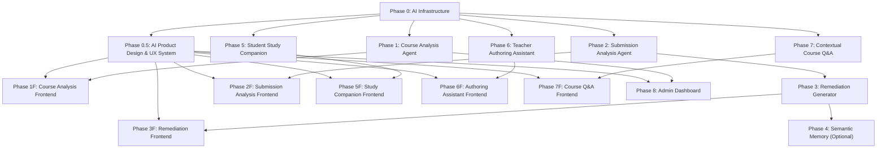

# AI Course Analysis & Adaptive Student Remediation — Implementation Plan

## Problem Statement

Ashyq Bilim needs a suite of production-grade AI features that transform the platform from a static LMS into an adaptive, AI-native learning system. All AI features use **GPT-5.5 (OpenAI) as the primary model** and **DeepSeek V4 (via OpenRouter) as an automatic fallback**.

1. **Course Quality Analysis Agent** — Multi-dimensional critical analysis of courses (structure, content relevance, lecture quality, assessment effectiveness, misinformation detection) that produces a 0–100 public score and actionable report. Triggered manually by teachers or automatically before course publication.

2. **Student Submission Analysis + Adaptive Remediation Agent** — On-demand critical analysis of student submissions that identifies knowledge gaps, then auto-generates a personalized micro-lecture and follow-up test targeting those gaps. Students must complete remediation before proceeding (when teacher enables gate mode). Optional long-term semantic memory for progressive personalization.

3. **Student AI Study Companion** — Context-aware AI that helps students absorb and deepen their understanding of course material. Operates within the activity the student is currently viewing — explains concepts, generates practice questions, creates flashcards, summarizes key takeaways, and offers Socratic dialogue to build deeper comprehension.

4. **Teacher AI Authoring Assistant** — AI-powered lecture writing, improvement, and critical analysis tool. Generates persistent improvement suggestions that remain visible until the teacher dismisses them or re-triggers analysis. Helps teachers write new lecture content, restructure existing lectures, improve clarity, and identify weak areas.

5. **Contextual Course Q&A** — Both teachers and students can ask custom free-form questions (prompts) about the course material, with all relevant course content (lectures, assessments, structure) injected as context. The AI answers grounded in the actual course content, citing specific lectures and sections.

## Current State

### What Already Exists

| Layer            | Asset                                                                                                                                                                           | Status                   |
| ---------------- | ------------------------------------------------------------------------------------------------------------------------------------------------------------------------------- | ------------------------ |
| **DB Schema**    | [ai_runtime.py](file:///x:/projects/ashyq-bilim/apps/api/src/db/ai_runtime.py) — `AIThread`, `AIRun`, `AIEvent`, `AIArtifactRecord`, `AIEvidence`, `AIApproval`, `AIEvalResult` | ✅ Migrated & registered |
| **DB Schema**    | [courses.py](file:///x:/projects/ashyq-bilim/apps/api/src/db/courses/courses.py) — `Course` with full metadata                                                                  | ✅ Production            |
| **DB Schema**    | [assessments.py](file:///x:/projects/ashyq-bilim/apps/api/src/db/assessments.py) — `Assessment`, `AssessmentItem` with CHOICE/OPEN_TEXT/FORM/CODE/MATCHING                      | ✅ Production            |
| **DB Schema**    | [submissions.py](file:///x:/projects/ashyq-bilim/apps/api/src/db/grading/submissions.py) — `Submission` with grading breakdown                                                  | ✅ Production            |
| **Dependencies** | `pydantic-ai-slim[logfire,openai]>=2.0.0`, `openai>=2.43.0`, `tiktoken>=0.13.0`, `pgvector>=0.4.2`                                                                              | ✅ Installed             |
| **Dependencies** | `@tanstack/ai-client`, `@tanstack/ai-react`, `@ag-ui/core`, `react-markdown`, `shiki`                                                                                           | ✅ Installed             |
| **Env vars**     | `PLATFORM_OPENAI_API_KEY`, `PLATFORM_OPENROUTER_API_KEY` in `.env.example`                                                                                                      | ✅ Defined               |
| **Router**       | [router.py](file:///x:/projects/ashyq-bilim/apps/api/src/router.py) — v1 router mounting all domain routes                                                                      | ✅ Production            |

### What Does NOT Exist (Needs Building)

| Gap                                                | Impact                              |
| -------------------------------------------------- | ----------------------------------- |
| No `AIConfig` settings class in `config/config.py` | AI env vars not loaded              |
| No AI service layer (`services/ai/`)               | No agent orchestration              |
| No AI router (`routers/ai/`)                       | No API endpoints                    |
| No PydanticAI agent definitions                    | No LLM interaction                  |
| No prompt templates                                | No structured prompting             |
| No OpenAI/OpenRouter client initialization         | No provider connectivity            |
| No course analysis DB table                        | Nowhere to persist analysis reports |
| No remediation session DB table                    | No adaptive learning state tracking |
| No frontend AI features directory                  | No teacher/student AI UI            |
| No SSE streaming infrastructure for AI             | No real-time analysis delivery      |

---

## Proposed Changes

### Phase 0: AI Infrastructure Foundation

> Wire up configuration, provider clients, token management, and the AI router scaffold. Every subsequent phase depends on this.

---

#### [NEW] `apps/api/src/services/ai/__init__.py`

Empty module init.

#### [NEW] `apps/api/src/services/ai/config.py`

AI-specific settings class registered in the app config chain:

```python
class AIConfig(BaseSettings):
    openai_api_key: str = ""
    openai_model: str = "gpt-5.5-turbo"          # Primary model
    openrouter_api_key: str = ""
    openrouter_model: str = "deepseek/deepseek-v4" # Fallback model
    openrouter_base_url: str = "https://openrouter.ai/api/v1"

    # Token budget
    max_tokens_per_request: int = 16_000
    max_output_tokens: int = 8_000
    monthly_token_budget: int = 5_000_000

    # Feature flags
    ai_enabled: bool = False
    course_analysis_enabled: bool = False
    submission_analysis_enabled: bool = False
    remediation_enabled: bool = False
    semantic_memory_enabled: bool = False

    # Rate limiting
    analysis_requests_per_hour_per_user: int = 10
    remediation_requests_per_hour_per_user: int = 20
```

#### [NEW] `apps/api/src/services/ai/providers.py`

Model routing with automatic fallback:

```python
class ModelProvider:
    """Routes to OpenAI primary or DeepSeek V4 via OpenRouter fallback."""

    async def get_model(self, prefer_primary: bool = True) -> Model
    async def estimate_tokens(self, text: str, model: str) -> int  # tiktoken
    async def check_budget(self, user_id: int, estimated_tokens: int) -> bool
```

#### [NEW] `apps/api/src/services/ai/token_budget.py`

Token counting (tiktoken) and budget enforcement:

- Pre-request token estimation
- Per-user hourly rate limiting
- Per-organization monthly budget tracking
- Writes to existing `AIRun` table for cost tracking

#### [MODIFY] `apps/api/config/config.py`

Add `AIConfig` to the settings chain. Wire `PLATFORM_OPENAI_API_KEY`, `PLATFORM_OPENROUTER_API_KEY`, and all AI env vars.

#### [NEW] `apps/api/src/routers/ai/__init__.py`

AI router module init.

#### [NEW] `apps/api/src/routers/ai/router.py`

Main AI router with sub-routers for course analysis, submission analysis, remediation, and token usage. Mounted at `/api/v1/ai`.

#### [MODIFY] `apps/api/src/router.py`

Add AI router import and mount:

```python
from src.routers.ai.router import router as ai_router
v1_router.include_router(ai_router, prefix="/ai", tags=["ai"])
```

---

### Phase 0.5: AI Product Design & UX System

> Build the shared AI experience layer before feature-specific UI. The goal is a calm, evidence-first learning assistant that feels trustworthy in production, stays understandable as models improve, and still looks intentional in 2030.

#### Design Read

Reading this as: role-based AI product UI for students, teachers, and admins, with a trust-first learning language, leaning toward the existing Next.js 16 + shadcn `base-nova` system, Tailwind v4 semantic tokens, lucide icons, dense but readable educational workflows, and restrained motion.

**Dial values:**

| Dial             |  Value | Reason                                                                                              |
| ---------------- | -----: | --------------------------------------------------------------------------------------------------- |
| Design variance  | 5 / 10 | The AI layer should feel modern without making teachers relearn the LMS.                            |
| Motion intensity | 3 / 10 | Motion communicates streaming, state changes, and progress. It must never distract from study work. |
| Visual density   | 6 / 10 | Teacher analysis and remediation decisions need scannable evidence, not marketing-page whitespace.  |

#### Product Principles

1. **Evidence before confidence**: every AI claim that affects a score, remediation gate, or teacher action must show source citations, confidence level, and the exact course or submission evidence used.
2. **Human control stays visible**: teachers approve publication checks, remediation generation, gate overrides, lecture edits, and suggestion dismissal. AI can propose, draft, and analyze, but people commit changes.
3. **Students keep agency**: remediation is required only when a teacher enables gate mode. The UI explains why the student is blocked, what they need to complete, how progress is measured, and who can help.
4. **No mystery state**: long AI work streams through visible stages: queued, collecting context, analyzing, drafting, checking citations, complete, failed, retriable.
5. **Role-specific trust boundaries**: student AI cannot reveal unpublished lectures, assessment answers, rubric internals, or teacher-only analysis. Teacher AI can see draft content and assessment keys when permission allows it.
6. **Multilingual by design**: every AI response follows course language by default and supports Kazakh, Russian, and English UI copy. The system stores detected language and lets teachers override response language.
7. **Durable over fashionable**: avoid AI-purple gradients, decorative chat bubbles, novelty animations, emoji controls, and fake glass effects. Use the existing LMS identity, strong typography, stable layout, and clear states.

#### Shared AI Interaction Model

All AI feature UIs must use the same state machine and event vocabulary so students and teachers learn one pattern.

```ts
type AIWorkState =
  | 'idle'
  | 'confirming'
  | 'queued'
  | 'collecting_context'
  | 'running'
  | 'checking_evidence'
  | 'complete'
  | 'needs_human_review'
  | 'failed'
  | 'cancelled'
```

| State                | UI behavior                                                                                            |
| -------------------- | ------------------------------------------------------------------------------------------------------ |
| `idle`               | Primary action is available. Secondary explainer text states what the AI will inspect.                 |
| `confirming`         | `AlertDialog` for actions that affect publication, gates, grades, or student progress.                 |
| `queued`             | Compact queued state with cancel where the backend supports cancellation.                              |
| `collecting_context` | Skeleton rows matching final report sections. Show context categories being collected, not raw tokens. |
| `running`            | Stream stage updates through SSE. Disable duplicate submit and keep the page usable.                   |
| `checking_evidence`  | Show citation verification progress before results appear.                                             |
| `complete`           | Show result, citations, timestamp, model used, and next best action.                                   |
| `needs_human_review` | Require teacher confirmation before applying content, publishing score, or releasing a gate.           |
| `failed`             | Inline recovery path: retry, use fallback model, reduce context, or contact support.                   |
| `cancelled`          | Preserve previous successful result and mark the latest run as cancelled.                              |

#### Shared UX Components

#### [NEW] `apps/web/src/features/ai-experience/`

Shared client and server-safe AI UI building blocks:

```
features/ai-experience/
├── api/
│   ├── use-ai-run-stream.ts              # Shared SSE subscription with reconnect and stage mapping
│   ├── use-ai-run-status.ts              # Polling fallback for environments without SSE
│   └── use-cancel-ai-run.ts              # Optional cancellation mutation
├── components/
│   ├── ai-action-button.tsx              # Button + Spinner + disabled state + aria-live text
│   ├── ai-run-timeline.tsx               # Stage timeline for long-running analysis
│   ├── ai-evidence-panel.tsx             # Source citations, snippets, confidence, and permissions
│   ├── ai-confidence-meter.tsx           # Calibrated confidence display, never decorative color only
│   ├── ai-result-shell.tsx               # Header, status, result body, actions, and audit metadata
│   ├── ai-empty-state.tsx                # shadcn Empty wrapper for no-result states
│   ├── ai-error-recovery.tsx             # Alert with retry/fallback/reduce-context actions
│   ├── ai-streaming-text.tsx             # Reduced-motion-safe streaming renderer
│   ├── ai-citation-link.tsx              # Deep link to lecture, assessment, submission, or rubric evidence
│   ├── ai-human-review-bar.tsx           # Sticky review actions for teacher approval flows
│   ├── ai-privacy-notice.tsx             # Role-aware data visibility note
│   └── ai-language-control.tsx           # Teacher/student response language selector
├── lib/
│   ├── ai-run-state.ts                   # Shared state machine helpers
│   ├── ai-copy.ts                        # Plain-language labels for all AI states
│   ├── ai-citations.ts                   # Citation parsing and deep-link helpers
│   ├── ai-permissions.ts                 # Role/visibility helpers used by UI gates
│   └── ai-design-tokens.ts               # Non-color constants: durations, density, radii, chart semantics
└── index.ts
```

#### shadcn Component Contract

The AI UI must compose existing shadcn components before adding custom markup.

| Need                       | Component contract                                                                                                    |
| -------------------------- | --------------------------------------------------------------------------------------------------------------------- |
| Primary actions            | `Button` with `Spinner`, `disabled`, and lucide icon using `data-icon`. No custom `isLoading` prop.                   |
| Confirmations              | `AlertDialog` for gate override, score publish, suggestion dismissal, and destructive thread deletion.                |
| Long result sections       | `Tabs`, `Accordion`, or `Resizable` depending on density. Avoid nested cards.                                         |
| Loading                    | `Skeleton` matching final layout. No blank panels for AI waits over 300ms.                                            |
| Empty state                | `Empty` with one useful action.                                                                                       |
| Errors                     | `Alert` near the failed result with a concrete recovery action.                                                       |
| Status labels              | `Badge` variants and semantic tokens. Never raw green/red Tailwind classes.                                           |
| Forms                      | `FieldGroup`, `Field`, `FieldLabel`, `FieldDescription`, `InputGroup`, `Textarea`, `Select`, `Switch`, `ToggleGroup`. |
| Streaming chat-like output | Existing `message`, `bubble`, and `message-scroller` components where conversational UI is appropriate.               |
| Charts                     | shadcn `Chart`, with text labels and tooltips so color is not the only carrier.                                       |

#### React and Next.js Architecture

1. **Server Components by default**: initial reports, histories, usage dashboards, and read-only result shells fetch in Server Components where routes support it.
2. **Client islands for interaction**: streaming, text selection, drawers, dialogs, flashcards, tests, and editor suggestions live in small `"use client"` leaves.
3. **No async Client Components**: fetch data in the server parent or through TanStack Query hooks inside client components.
4. **Serializable boundaries only**: pass plain objects, arrays, strings, numbers, and ISO date strings from Server Components into client islands.
5. **Streaming inside Suspense**: AI panels that depend on `useSearchParams`, `usePathname`, or long-running stream setup must sit inside Suspense with layout-stable skeletons.
6. **Cache Components ready**: with Next.js 16, enable `cacheComponents` when the app is ready. Cache stable course metadata, feature flags, and public analysis history with `use cache`, `cacheLife`, and `cacheTag`; keep per-user permissions, draft content, and active AI runs dynamic.
7. **Parallel data loading**: start course metadata, latest analysis, feature flags, and permission checks together. Avoid waterfalls in AI-heavy pages.
8. **Bundle control**: dynamically import heavy markdown, code highlighting, chart, mermaid, and editor-adjacent UI only where used. Keep the default course view fast for students who never open AI panels.
9. **No module-level request state**: AI run state comes from backend records, SSE events, TanStack Query cache, or component state. Never store request-specific AI state in shared modules.

#### Composition Patterns

Use compound components for reusable AI surfaces rather than boolean-heavy components.

```tsx
<AIResultShell.Provider value={runContext}>
  <AIResultShell.Frame>
    <AIResultShell.Header />
    <AIResultShell.StatusTimeline />
    <AIResultShell.EvidencePanel />
    <AIResultShell.Actions />
  </AIResultShell.Frame>
</AIResultShell.Provider>
```

Create explicit variants for each feature:

- `CourseAnalysisResultShell`
- `SubmissionAnalysisResultShell`
- `RemediationResultShell`
- `StudyCompanionPanel`
- `LectureReviewPanel`
- `CourseQAPanel`

Avoid props like `isTeacher`, `isStudent`, `isGateMode`, `showScore`, `isCompact`, and `isStreaming` on one monolithic component. Compose role-specific variants from shared parts and inject state through a provider interface with `state`, `actions`, and `meta`.

#### Information Architecture

| Surface             | Placement                                                                   | UX intent                                                                   |
| ------------------- | --------------------------------------------------------------------------- | --------------------------------------------------------------------------- |
| Course analysis     | Teacher course detail tab plus compact score in course cards when visible   | Make quality visible without blocking course editing.                       |
| Submission analysis | Teacher grading side panel                                                  | Keep evidence next to the submission and rubric.                            |
| Remediation         | Student blocking banner, dedicated remediation route, teacher history panel | Explain the gate, then guide the student through one focused recovery path. |
| Study companion     | Activity side panel on desktop, bottom drawer on mobile                     | Help without covering the lecture or assessment context.                    |
| Authoring assistant | Lecture editor sidebar plus inline suggestion anchors                       | Keep teacher in control of the actual editor.                               |
| Contextual Q&A      | Course and activity side panel with thread history                          | Make it feel like course-aware help, not a generic chatbot.                 |
| Admin usage         | Admin dashboard under AI settings                                           | Expose cost, latency, fallback rate, error rate, and feature health.        |

Every AI panel needs deep links for shareable state:

- `?ai=analysis&run=<run_uuid>`
- `?ai=study&mode=explain&activity=<activity_uuid>`
- `?ai=qa&thread=<thread_uuid>`
- `?ai=remediation&session=<session_uuid>`

Back/forward behavior must close drawers, return to previous tabs, and preserve generated output without restarting runs.

#### Visual Design System

Use the current shadcn `base-nova` preset and Tailwind v4 token flow. Do not introduce a second design system.

**Token direction:**

| Token                                                 | Use                                                                                                                                                                                            |
| ----------------------------------------------------- | ---------------------------------------------------------------------------------------------------------------------------------------------------------------------------------------------- |
| `--background`, `--foreground`, `--card`, `--popover` | Existing base surfaces.                                                                                                                                                                        |
| `--primary`, `--primary-foreground`                   | Main AI action and selected state.                                                                                                                                                             |
| `--secondary`, `--secondary-foreground`               | Neutral AI panels and non-primary actions.                                                                                                                                                     |
| `--muted`, `--muted-foreground`                       | Explanatory metadata, timestamps, model labels.                                                                                                                                                |
| `--destructive`, `--destructive-foreground`           | Failures, unsafe content flags, gate blocks.                                                                                                                                                   |
| `--ring`                                              | Keyboard focus, selected citation, active text selection.                                                                                                                                      |
| New semantic tokens only if needed                    | `--ai-confidence-high`, `--ai-confidence-medium`, `--ai-confidence-low`, `--ai-evidence-highlight`, `--ai-gate-blocked`. Add them in `apps/web/src/styles/globals.css`, not inside components. |

**Visual rules:**

- Keep one icon family: lucide, matching `components.json`.
- Use one radius system. Cards and panels stay at the existing shadcn radius. Buttons follow the component preset.
- AI output should look like structured educational material, not chat by default. Use chat bubbles only for Q&A and Socratic dialogue.
- Charts must include labels, legends, and tooltips. Red/yellow/green score colors need text labels and icons.
- Use tabular numbers for scores, token counts, costs, pass thresholds, and durations to prevent layout shift.
- Keep long AI prose inside readable measures. Reports can be dense, but paragraphs should not stretch across full desktop width.

#### Motion and Feedback

- Respect `prefers-reduced-motion` for all streaming, progress, drawer, and flashcard interactions.
- Use 150-300ms transitions for panel open/close, selected citations, and status changes.
- Do not animate width, height, or layout for streaming output. Use opacity and transform only.
- Streaming text should be readable at normal speed, pause when the tab is hidden, and render instantly for reduced motion.
- Remove celebratory confetti from the default remediation pass flow. Use a restrained success state that respects the study context.
- Every async action needs button disablement, visible pending state, and retry behavior.

#### Accessibility and Inclusive Learning

1. **Keyboard complete**: every AI workflow must work without a pointer, including text selection alternatives, flashcard controls, dialogs, drawers, and citation navigation.
2. **Focus management**: opening an AI panel moves focus to the panel title. Closing restores focus to the trigger. Failed form submit focuses the first invalid field.
3. **Live regions**: streaming progress uses `aria-live="polite"` for stage changes. Do not announce every streamed token.
4. **Touch targets**: all controls are at least 44px high with 8px spacing.
5. **Readable generated content**: minimum 16px body text, 1.5 line height, no color-only meaning, and user-controlled copy/download where allowed.
6. **Cognitive load**: students get one primary next action per remediation step. Teacher reports can expose more detail, but each section starts with a summary and evidence.
7. **Assessment safety**: study companion controls are disabled or narrowed during exams with a clear reason and a link back after the exam.
8. **Localization**: UI labels must not assume English sentence length. Buttons and badges should allow wrapping or use shorter localized labels.
9. **RTL ready**: since shadcn config has `rtl: true`, AI panels and citations must avoid left/right-only language. Use logical CSS properties where custom layout is needed.

#### Trust, Safety, and Audit UX

All AI-generated results must expose:

- Model used and provider fallback status.
- Run timestamp and last updated time.
- Who triggered the run.
- Data scope used: course, chapter, activity, submission, rubric, prior memory.
- Citation count and failed citation checks.
- Confidence label with plain-language meaning.
- Teacher-visible audit trail for applied, dismissed, overridden, or re-run AI suggestions.

For high-impact actions:

| Action                    | Required UX guardrail                                                          |
| ------------------------- | ------------------------------------------------------------------------------ |
| Publish course score      | Teacher confirmation with preview of public visibility.                        |
| Generate remediation gate | Teacher confirmation that explains student impact.                             |
| Override remediation gate | Reason field and audit trail.                                                  |
| Apply lecture suggestion  | Inline diff or selected text preview before applying.                          |
| Delete Q&A thread         | `AlertDialog` and immediate undo where possible.                               |
| Use semantic memory       | Consent copy that explains what is stored and how it improves personalization. |

#### Empty, Error, and Edge States

Each feature must ship with these states before release:

- AI disabled by environment or course setting.
- Missing API key or provider unavailable.
- User has no permission for the current AI surface.
- Course has too little content to analyze.
- Course is too large for one-pass analysis and needs chapter mode.
- No evidence found for a model claim.
- SSE disconnected with polling fallback.
- OpenAI failed and OpenRouter fallback is running.
- Fallback also failed.
- Generated content violates validation schema and needs regeneration.
- Student opens a gated activity after teacher override.
- Teacher sees stale analysis after course content changed.

#### Feature-Specific UX Requirements

| Feature             | UX requirement                                                                                                                 |
| ------------------- | ------------------------------------------------------------------------------------------------------------------------------ |
| Course analysis     | Show overall score only with axis breakdown, evidence, and improvement path. Do not let a bare number stand alone.             |
| Submission analysis | Keep tone teacher-facing and evidence-based. Avoid labels that shame the student.                                              |
| Remediation         | Show why the student is blocked, what will happen next, time estimate, pass threshold, retry count, and teacher override path. |
| Study companion     | Default to concise output. Offer "go deeper" rather than producing long explanations first.                                    |
| Authoring assistant | Suggestions persist with exact anchors and can be applied, dismissed, or re-run. The editor remains the source of truth.       |
| Course Q&A          | Always show citations and role scope. Student answers must never imply access to hidden material.                              |
| Admin usage         | Show cost, latency, fallback rate, error rate, and feature adoption with filters by course and time range.                     |

#### Performance Budgets

| Budget                                                 |                                Target |
| ------------------------------------------------------ | ------------------------------------: |
| Initial course page client JS added by AI entry points | <= 35 KB gzip before opening AI panel |
| AI panel interaction response after click              |           <= 100 ms local UI feedback |
| First streamed stage event                             |   <= 1.5 s p95 after request accepted |
| Report route LCP                                       |                          <= 2.5 s p75 |
| INP on AI-heavy pages                                  |                         <= 200 ms p75 |
| CLS from streaming/progress UI                         |                                <= 0.1 |
| SSE reconnect                                          | <= 3 attempts before polling fallback |

Use route-level splitting and `next/dynamic` for charts, markdown extensions, mermaid, shiki, and editor helpers. Reserve dimensions for generated charts, skeletons, and result panels so streaming content does not shift the page.

#### Design QA Checklist

Before any AI feature leaves its frontend phase:

- [ ] Uses shared `features/ai-experience` state and copy helpers.
- [ ] Uses shadcn primitives and semantic tokens, with no raw component colors.
- [ ] Has loading, empty, failed, disconnected, fallback-provider, and permission-denied states.
- [ ] Has keyboard, screen reader, touch, reduced-motion, and high-contrast checks.
- [ ] Has citations or a clear "no supporting evidence found" state.
- [ ] Has audit metadata for model, provider, trigger user, timestamp, and data scope.
- [ ] Has URL-addressable panel state and correct back/forward behavior.
- [ ] Does not expose teacher-only data to students.
- [ ] Does not block the main course or editor UI while AI runs.
- [ ] Passes Playwright at 375px, 768px, 1024px, and 1440px.
- [ ] Passes dark mode and RTL smoke checks.
- [ ] Keeps generated text copy direct, specific, and free of vague AI marketing language.

---

### Phase 1: Course Quality Analysis Agent

> The flagship feature. Teachers click "Analyze with AI" or analysis runs before publishing. AI evaluates the entire course structure and produces a detailed report with a 0–100 score.

---

#### [NEW] `apps/api/src/db/ai_course_analysis.py`

New SQLModel table for persisting course analysis reports:

```python
class AICourseAnalysis(SQLModelStrictBaseModel, table=True):
    """Persistent record of an AI course quality analysis."""
    id: int | None = Field(default=None, primary_key=True)
    analysis_uuid: str                           # Public-facing UUID
    course_id: int                               # FK → course.id
    run_id: int                                  # FK → ai_run.id

    # Scores (0–100)
    overall_score: int
    structure_score: int                         # Logical flow, prerequisites, sequencing
    relevance_score: int                         # Timeliness, industry alignment
    lecture_quality_score: int                    # Depth, clarity, completeness
    assessment_quality_score: int                # Practical value, alignment, difficulty
    misinformation_score: int                    # Factual accuracy (inverted: 100 = no issues)
    coverage_score: int                          # Missing vs redundant topics

    # Detailed findings
    issues: JsonObject                           # [{axis, severity, title, detail, location}]
    recommendations: JsonObject                  # [{axis, priority, action, rationale}]
    strengths: JsonObject                        # [{axis, title, detail}]
    topic_relevance_map: JsonObject              # {topic: {relevant: bool, reason: str}}

    # Metadata
    model_used: str
    input_tokens: int
    output_tokens: int
    analysis_duration_ms: int

    # Visibility
    score_visible: bool = True                   # Public by default, teacher can hide

    created_at: datetime
```

#### [NEW] `apps/api/src/services/ai/agents/course_analyst.py`

PydanticAI agent for course analysis — the core intelligence:

```python
from pydantic_ai import Agent

course_analyst_agent = Agent(
    model=...,  # resolved at runtime via ModelProvider
    output_type=CourseAnalysisResult,  # Structured Pydantic output
    system_prompt="...",  # Loaded from prompt template
    tools=[
        get_course_metadata,      # name, description, tags, learnings
        get_course_structure,     # chapters → activities hierarchy
        get_lecture_content,      # markdown content of each activity
        get_assessment_items,     # all quiz/exam questions with rubrics
        get_assessment_policies,  # grading settings, time limits, attempts
    ],
)
```

**Analysis Axes (each scored 0–100):**

| Axis                    | What It Evaluates                                                                                             |
| ----------------------- | ------------------------------------------------------------------------------------------------------------- |
| **Structure & Flow**    | Chapter ordering, prerequisite chains, topic sequencing, progressive complexity, redundancy                   |
| **Content Relevance**   | Industry alignment, currency of topics, practical applicability, outdated material detection                  |
| **Lecture Quality**     | Depth of explanations, clarity, missing key concepts, over-emphasis on trivial topics, completeness           |
| **Assessment Quality**  | Alignment with learning objectives, practical value of assignments, difficulty distribution, question quality |
| **Misinformation Risk** | Factual accuracy of claims, outdated technical information, misleading explanations                           |
| **Coverage**            | Missing essential topics for the subject, unnecessary tangential topics, balance of theory vs practice        |

**Output Schema:**

```python
class CourseAnalysisResult(BaseModel):
    overall_score: int = Field(ge=0, le=100)
    axes: dict[str, AxisScore]  # 6 axes above
    critical_issues: list[Issue]  # Severity: critical, major, minor
    recommendations: list[Recommendation]  # Priority: high, medium, low
    strengths: list[Strength]
    topic_relevance_map: dict[str, TopicRelevance]
    executive_summary: str  # 2-3 paragraph overview
```

#### [NEW] `apps/api/src/services/ai/prompts/course_analysis.md`

Versioned prompt template with structured analysis instructions. Uses `{course_name}`, `{course_description}`, `{chapter_structure}`, `{lecture_contents}`, `{assessment_items}` placeholders.

The prompt must instruct the model to:

1. Evaluate each axis independently with specific evidence
2. Identify factual inaccuracies with citations to specific lectures
3. Flag outdated content with suggested replacements
4. Detect structural problems (e.g., advanced topics before prerequisites)
5. Assess whether assignments test meaningful skills vs busywork
6. Calculate composite score as weighted average (not simple mean)

#### [NEW] `apps/api/src/routers/ai/course_analysis.py`

API endpoints:

| Method  | Path                                            | Description                                   |
| ------- | ----------------------------------------------- | --------------------------------------------- |
| `POST`  | `/ai/courses/{course_uuid}/analyze`             | Trigger course analysis (teacher/author only) |
| `GET`   | `/ai/courses/{course_uuid}/analysis`            | Get latest analysis report                    |
| `GET`   | `/ai/courses/{course_uuid}/analysis/history`    | Get all past analyses for comparison          |
| `PATCH` | `/ai/courses/{course_uuid}/analysis/visibility` | Toggle score visibility (teacher only)        |
| `GET`   | `/ai/courses/{course_uuid}/analysis/stream`     | SSE stream for real-time analysis progress    |

The `POST /analyze` endpoint:

1. Validates teacher/author role and rate limit
2. Collects all course data (metadata, structure, lecture content, assessments)
3. Estimates tokens with tiktoken and checks budget
4. Creates `AIThread` + `AIRun` records
5. Runs `course_analyst_agent` with streaming
6. Persists `AICourseAnalysis` with full report
7. Returns analysis UUID for polling or streams events via SSE

#### [NEW] `apps/api/src/services/ai/context/course_context.py`

Course context assembler — collects and formats all course data for the agent:

```python
class CourseContextAssembler:
    async def assemble(self, course_id: int) -> CourseContext:
        """Collects course metadata, chapter tree, lecture content,
        assessment items, and assessment policies into a structured
        context object for the course analyst agent."""
```

#### [NEW] Alembic migration for `ai_course_analysis` table

Standard migration adding the table with indices on `course_id` and `created_at`.

---

#### Frontend — Course Analysis UI

#### [NEW] `apps/web/src/features/course-analysis/`

New feature module:

```
features/course-analysis/
├── api/
│   ├── use-analyze-course.ts          # TanStack mutation to trigger analysis
│   ├── use-course-analysis.ts         # TanStack query to fetch latest report
│   ├── use-analysis-stream.ts         # SSE hook for real-time progress
│   └── use-toggle-visibility.ts       # Mutation for score visibility
├── components/
│   ├── analyze-button.tsx             # "Analyze with AI" action button
│   ├── analysis-report.tsx            # Full analysis report display
│   ├── axis-score-card.tsx            # Individual axis score visualization
│   ├── score-radar-chart.tsx          # Radar/spider chart of all 6 axes
│   ├── issues-list.tsx                # Categorized issues with severity badges
│   ├── recommendations-list.tsx       # Prioritized actionable recommendations
│   ├── strengths-list.tsx             # Positive findings
│   ├── topic-relevance-map.tsx        # Visual map of topic relevance
│   ├── analysis-progress.tsx          # Streaming progress indicator
│   ├── score-badge.tsx                # Compact score badge (0-100 with color)
│   ├── visibility-toggle.tsx          # Toggle score public/hidden
│   └── analysis-history.tsx           # Comparison of past analyses
├── lib/
│   ├── types.ts                       # TypeScript types for analysis data
│   └── score-utils.ts                 # Score color mapping, formatting
└── index.ts
```

**Integration Points:**

- `analyze-button.tsx` placed in course detail page header (teacher view only)
- `score-badge.tsx` shown on course cards in listings (when score visible)
- `analysis-report.tsx` as a tab or panel in course detail page
- Auto-trigger analysis before course publishing (with teacher consent dialog)

---

### Phase 2: Student Submission Analysis Agent

> Teachers click "Analyze with AI" on a student submission. AI evaluates correctness, identifies knowledge gaps, and provides a structured weakness report.

---

#### [NEW] `apps/api/src/db/ai_submission_analysis.py`

```python
class AISubmissionAnalysis(SQLModelStrictBaseModel, table=True):
    id: int | None = Field(default=None, primary_key=True)
    analysis_uuid: str
    submission_id: int                 # FK → submission (grading system)
    student_id: int                    # FK → user.id
    course_id: int                     # FK → course.id
    activity_id: int                   # FK → activity.id
    run_id: int                        # FK → ai_run.id

    # Analysis
    correctness_score: int             # 0–100
    knowledge_gaps: JsonObject         # [{topic, severity, evidence, expected_understanding}]
    strengths: JsonObject              # [{topic, detail}]
    weaknesses: JsonObject             # [{topic, detail, recommended_study}]
    effort_assessment: str             # "thorough" | "adequate" | "minimal" | "insufficient"
    misconceptions: JsonObject         # [{concept, student_belief, correct_understanding}]

    # For remediation generation
    recommended_topics: JsonObject     # Prioritized list for remediation
    difficulty_calibration: str        # "too_easy" | "appropriate" | "too_hard"

    # Metadata
    model_used: str
    input_tokens: int
    output_tokens: int

    created_at: datetime
```

#### [NEW] `apps/api/src/services/ai/agents/submission_analyst.py`

PydanticAI agent for submission analysis:

```python
submission_analyst_agent = Agent(
    model=...,
    output_type=SubmissionAnalysisResult,
    system_prompt="...",
    tools=[
        get_activity_content,       # The lesson/activity the submission is for
        get_assessment_rubric,      # Grading criteria and rubric
        get_submission_content,     # Student's actual submission
        get_student_score,          # Teacher-assigned score if available
        get_course_learning_goals,  # Overall course objectives
    ],
)
```

**Analysis Dimensions:**

- **Correctness**: How well the submission meets the assessment criteria
- **Knowledge Gaps**: Specific topics/concepts the student struggles with, with evidence
- **Misconceptions**: Incorrect mental models detected in the response
- **Effort Level**: Whether the student engaged deeply or superficially
- **Difficulty Calibration**: Whether the assessment was appropriate for the student's level

#### [NEW] `apps/api/src/services/ai/prompts/submission_analysis.md`

Prompt template instructing the model to:

1. Compare submission against rubric/expected answers
2. Identify specific knowledge gaps with evidence from the submission
3. Detect misconceptions (not just wrong answers, but _why_ they're wrong)
4. Assess effort and engagement level
5. Prioritize topics for remediation based on gap severity

#### [NEW] `apps/api/src/routers/ai/submission_analysis.py`

| Method | Path                                                | Description                                |
| ------ | --------------------------------------------------- | ------------------------------------------ |
| `POST` | `/ai/submissions/{submission_uuid}/analyze`         | Trigger submission analysis (teacher only) |
| `GET`  | `/ai/submissions/{submission_uuid}/analysis`        | Get analysis report                        |
| `GET`  | `/ai/submissions/{submission_uuid}/analysis/stream` | SSE stream for analysis progress           |

---

#### Frontend — Submission Analysis UI

#### [NEW] `apps/web/src/features/submission-analysis/`

```
features/submission-analysis/
├── api/
│   ├── use-analyze-submission.ts
│   └── use-submission-analysis.ts
├── components/
│   ├── analyze-submission-button.tsx  # Button in teacher's submission view
│   ├── submission-analysis-card.tsx   # Analysis results display
│   ├── knowledge-gaps-list.tsx        # Visual gap identification
│   ├── misconceptions-list.tsx        # Misconception cards
│   ├── remediation-trigger.tsx        # "Generate Remediation" button
│   └── analysis-loading.tsx           # Streaming analysis progress
└── index.ts
```

**Integration Points:**

- `analyze-submission-button.tsx` in the grading/submission detail view (teacher only)
- `submission-analysis-card.tsx` shown alongside the teacher's grading interface
- `remediation-trigger.tsx` appears after analysis completes, linking to Phase 3

---

### Phase 3: Adaptive Remediation Generation Agent

> After submission analysis identifies gaps, AI generates a personalized micro-lecture and follow-up test. Students must complete remediation before proceeding (gate mode).

---

#### [NEW] `apps/api/src/db/ai_remediation.py`

```python
class AIRemediationSession(SQLModelStrictBaseModel, table=True):
    id: int | None = Field(default=None, primary_key=True)
    session_uuid: str
    student_id: int                    # FK → user.id
    course_id: int                     # FK → course.id
    activity_id: int                   # FK → activity.id (original activity)
    submission_analysis_id: int        # FK → ai_submission_analysis.id
    run_id: int                        # FK → ai_run.id

    # Generated content
    lecture_title: str
    lecture_content: str               # Markdown — personalized micro-lecture
    lecture_summary: str               # Brief overview of what the lecture covers
    target_gaps: JsonObject            # Which knowledge gaps this remediates

    # Generated test
    test_questions: JsonObject         # [{question, type, options?, correct_answer, explanation, gap_ref}]
    test_passing_score: int            # Minimum score to pass (default 70%)

    # Student progress
    status: str                        # "pending" | "lecture_viewed" | "test_started" | "passed" | "failed"
    lecture_viewed_at: datetime | None
    test_started_at: datetime | None
    test_completed_at: datetime | None
    test_score: int | None
    test_answers: JsonObject | None    # Student's answers for review
    attempts: int = 0
    max_attempts: int = 3

    # Gate mode
    gates_next_activity: bool = False  # If True, blocks progression
    gate_released_at: datetime | None  # When student passed or teacher overrode
    gate_released_by: str | None       # "passed" | "teacher_override"

    # Metadata
    model_used: str
    input_tokens: int
    output_tokens: int

    created_at: datetime
    updated_at: datetime
```

#### [NEW] `apps/api/src/services/ai/agents/remediation_generator.py`

Two-step agent — generates lecture first, then test:

```python
remediation_lecture_agent = Agent(
    model=...,
    output_type=RemediationLecture,
    system_prompt="...",
    tools=[
        get_knowledge_gaps,         # From submission analysis
        get_original_activity,      # What the student was supposed to learn
        get_course_context,         # Broader course goals for context
        get_student_history,        # (Optional) semantic memory if enabled
    ],
)

remediation_test_agent = Agent(
    model=...,
    output_type=RemediationTest,
    system_prompt="...",
    tools=[
        get_generated_lecture,      # The lecture we just generated
        get_knowledge_gaps,         # Target these specific gaps
    ],
)
```

**Lecture Generation Rules:**

1. Focus exclusively on the student's specific knowledge gaps
2. Use clear explanations with practical examples
3. Build from what the student already demonstrated understanding of
4. Include visual aids (diagrams as markdown/mermaid when applicable)
5. Target 5–15 minute reading time (not too long, not too short)
6. Write in the same language as the course content

**Test Generation Rules:**

1. Each question maps to a specific knowledge gap
2. Mix question types: multiple choice, short answer, true/false
3. Include distractors based on the student's actual misconceptions
4. Minimum 5 questions, maximum 10
5. Include detailed explanations for correct answers
6. Set passing score at 70% by default

#### [NEW] `apps/api/src/services/ai/prompts/remediation_lecture.md`

Template for generating personalized remediation lectures.

#### [NEW] `apps/api/src/services/ai/prompts/remediation_test.md`

Template for generating follow-up tests targeting identified gaps.

#### [NEW] `apps/api/src/routers/ai/remediation.py`

| Method | Path                                           | Description                                             |
| ------ | ---------------------------------------------- | ------------------------------------------------------- |
| `POST` | `/ai/remediation/generate`                     | Generate remediation from submission analysis (teacher) |
| `GET`  | `/ai/remediation/{session_uuid}`               | Get remediation session (student/teacher)               |
| `POST` | `/ai/remediation/{session_uuid}/view-lecture`  | Mark lecture as viewed (student)                        |
| `POST` | `/ai/remediation/{session_uuid}/submit-test`   | Submit test answers (student)                           |
| `POST` | `/ai/remediation/{session_uuid}/override-gate` | Teacher overrides gate (teacher)                        |
| `GET`  | `/ai/remediation/{session_uuid}/stream`        | SSE stream for generation progress                      |
| `GET`  | `/ai/students/{student_uuid}/remediation`      | List all remediation sessions (teacher)                 |

**Gate Mode Flow:**

1. Teacher enables "Require remediation before next activity" on course settings
2. When AI generates remediation, `gates_next_activity = True`
3. Student's activity progression check queries `AIRemediationSession` for pending remediations
4. Student must: view lecture → pass test → gate releases → can proceed
5. Teacher can override gate at any time

#### [MODIFY] `apps/api/src/services/student_activity_runtime.py`

Add remediation gate check to the activity progression logic:

```python
async def can_proceed_to_next_activity(student_id: int, current_activity_id: int) -> bool:
    # Check for pending remediation sessions that gate progression
    pending = await get_pending_remediation_gates(student_id, current_activity_id)
    if pending:
        return False  # Must complete remediation first
    return True  # Original progression logic
```

---

#### Frontend — Remediation UI

#### [NEW] `apps/web/src/features/remediation/`

```
features/remediation/
├── api/
│   ├── use-generate-remediation.ts    # Mutation to trigger generation
│   ├── use-remediation-session.ts     # Query for session data
│   ├── use-submit-remediation-test.ts # Mutation for test submission
│   ├── use-view-lecture.ts            # Mutation to mark lecture viewed
│   └── use-override-gate.ts           # Teacher gate override mutation
├── components/
│   ├── remediation-launcher.tsx       # Teacher: "Generate Remediation" after analysis
│   ├── remediation-notification.tsx   # Student: notification of new remediation
│   ├── remediation-lecture.tsx        # Student: markdown lecture viewer
│   ├── remediation-test.tsx           # Student: interactive test component
│   ├── remediation-result.tsx         # Student: test result with pass/fail
│   ├── remediation-progress.tsx       # Progress bar (lecture → test → done)
│   ├── remediation-gate-banner.tsx    # Student: "Complete remediation to proceed"
│   ├── remediation-gate-override.tsx  # Teacher: manual gate release
│   ├── remediation-history.tsx        # Teacher: all student remediations
│   └── generation-progress.tsx        # Streaming generation indicator
├── lib/
│   ├── types.ts
│   └── test-grading.ts               # Client-side test scoring for immediate feedback
└── index.ts
```

**Student Remediation Flow (UI):**

1. Student sees a banner on the next activity: "AI has identified knowledge gaps. Complete a short review before continuing."
2. Student opens remediation → sees progress: `Lecture` → `Test` → `Complete`
3. **Lecture view**: Rendered markdown with syntax highlighting, mermaid diagrams. "Mark as Read" button after scrolling/spending minimum time.
4. **Test view**: Interactive quiz with the generated questions. Submit button. Immediate scoring with explanations.
5. **Result view**: Score, pass/fail, per-question breakdown with explanations. If failed, can retry (up to max_attempts).
6. On pass: gate releases, student can proceed. Show a restrained success state with clear next action.

---

### Phase 4: Semantic Memory (Optional)

> Long-term student learning profile stored as embeddings in pgvector. Enables increasingly personalized remediation over time.

---

#### [NEW] `apps/api/src/db/ai_student_memory.py`

```python
class AIStudentMemory(SQLModelStrictBaseModel, table=True):
    id: int | None = Field(default=None, primary_key=True)
    student_id: int                    # FK → user.id
    course_id: int                     # FK → course.id

    # Knowledge state
    topic: str                         # Topic/concept identifier
    understanding_level: str           # "none" | "weak" | "developing" | "solid" | "mastered"
    evidence: JsonObject               # [{source: "submission|remediation|test", score, date}]

    # Embedding for semantic search
    embedding: Vector(1536)            # pgvector — for finding related topics
    content_summary: str               # Human-readable summary

    # Metadata
    first_seen_at: datetime
    last_updated_at: datetime
    update_count: int = 1
```

#### [NEW] `apps/api/src/services/ai/memory/student_memory.py`

Semantic memory service:

```python
class StudentMemoryService:
    async def record_learning_event(self, student_id, course_id, topic, understanding_level, evidence)
    async def get_knowledge_profile(self, student_id, course_id) -> StudentKnowledgeProfile
    async def find_related_gaps(self, student_id, topic_embedding) -> list[RelatedGap]
    async def get_learning_trajectory(self, student_id, course_id) -> LearningTrajectory
```

**How It Enhances Remediation:**

- When generating remediation, the agent queries student memory for patterns
- If the student consistently struggles with the same concept across multiple submissions, remediation goes deeper
- Memory tracks improvement over time, allowing the agent to calibrate difficulty
- Teachers can view a student's learning trajectory dashboard

#### Frontend — Student Memory Dashboard

Minimal additions:

- `student-knowledge-map.tsx` — Visual knowledge map showing topics by understanding level
- Integrated into remediation generation as additional context
- Teacher can view per-student learning profiles

---

### Phase 5: Student AI Study Companion

> Embedded AI study instrument that helps students absorb, practice, and deepen their understanding of course material. Not a generic chatbot — a structured learning tool that operates within the context of the activity the student is currently viewing.

---

#### Design Principles

- AI never covers or replaces the primary learning content
- AI must protect learning: hints before answers, practice before solutions
- All responses grounded in actual course content with citations
- Operates in structured modes, not freeform chat
- Assessment lockout: AI study features are restricted during exams/timed assessments
- Uses GPT-5.5 (OpenAI) primary, DeepSeek V4 (OpenRouter) fallback

#### [NEW] `apps/api/src/services/ai/agents/study_companion.py`

PydanticAI agent with 5 structured study modes:

```python
from pydantic_ai import Agent
from pydantic_ai.models.fallback import FallbackModel
from pydantic_ai.models.openai import OpenAIChatModel

study_companion_agent = Agent(
    model=FallbackModel(
        OpenAIChatModel('gpt-5.5-turbo'),  # Primary
        OpenAIChatModel('deepseek/deepseek-v4', base_url='https://openrouter.ai/api/v1'),  # Fallback
    ),
    output_type=StudyResponse,
    instructions="...",
    tools=[
        get_current_activity_content,   # The lecture/activity the student is viewing
        get_chapter_context,            # Surrounding chapter for broader context
        get_course_learning_goals,      # What the student should learn
        get_student_progress,           # What the student has completed so far
        search_course_content,          # Semantic search across all course material
    ],
)
```

**Study Modes:**

| Mode           | What It Does                                                                                                                                                                   | Output Type                                                                   |
| -------------- | ------------------------------------------------------------------------------------------------------------------------------------------------------------------------------ | ----------------------------------------------------------------------------- |
| **Explain**    | Explains a selected passage, concept, code block, or term using alternative examples, analogies, and simpler language. Student can select text and ask "Explain this."         | `ExplanationCard` — structured explanation with examples and related concepts |
| **Practice**   | Generates retrieval questions, mini-quizzes, and application problems based on the current lecture content. Tests understanding without giving away graded assessment answers. | `PracticeSet` — 3–7 questions with self-check answers and explanations        |
| **Flashcards** | Creates spaced-repetition flashcards from key concepts in the current activity. Students can save these to a personal deck.                                                    | `FlashcardDeck` — front/back pairs with difficulty tags                       |
| **Summarize**  | Produces a structured summary of the current activity — key takeaways, core concepts, and "what you should be able to do after this."                                          | `ActivitySummary` — key points, concepts, and learning check                  |
| **Deepen**     | Socratic dialogue mode. Instead of giving direct answers, asks probing questions that lead the student to discover the answer themselves. Builds critical thinking.            | `SocraticExchange` — question ladder with progressive hints                   |

**Output Schemas:**

```python
class ExplanationCard(BaseModel):
    concept: str
    explanation: str                   # Clear, simple explanation
    analogy: str | None                # Real-world analogy if applicable
    examples: list[str]                # Concrete examples
    related_concepts: list[str]        # Links to other concepts in the course
    citations: list[ContentCitation]   # Where in the course this comes from

class PracticeSet(BaseModel):
    questions: list[PracticeQuestion]   # 3–7 questions
    estimated_time_minutes: int
    difficulty: str                     # "recall" | "application" | "analysis"

class FlashcardDeck(BaseModel):
    cards: list[Flashcard]              # front/back pairs
    topic: str
    suggested_review_interval: str      # "today" | "tomorrow" | "3_days"

class ActivitySummary(BaseModel):
    key_takeaways: list[str]            # 3–5 bullet points
    core_concepts: list[ConceptDefinition]
    learning_check: list[str]           # "Can you..." self-check questions
    next_steps: str                     # What to focus on next

class SocraticExchange(BaseModel):
    opening_question: str               # Thought-provoking question
    hint_ladder: list[str]              # Progressive hints (3 levels)
    guiding_questions: list[str]        # Follow-up questions to guide thinking
    resolution: str                     # Final explanation (revealed after student engages)
```

#### [NEW] `apps/api/src/services/ai/prompts/study_companion.md`

Prompt template with mode-specific instructions. Key rules:

1. Never reveal graded assessment answers
2. Always cite specific lecture content
3. Adapt language to match course content language (KZ/RU/EN)
4. Encourage active thinking over passive consumption
5. Keep responses concise — students are studying, not reading essays

#### [NEW] `apps/api/src/routers/ai/study_companion.py`

| Method | Path                                   | Description                           |
| ------ | -------------------------------------- | ------------------------------------- |
| `POST` | `/ai/study/{activity_uuid}/explain`    | Explain selected content (student)    |
| `POST` | `/ai/study/{activity_uuid}/practice`   | Generate practice questions (student) |
| `POST` | `/ai/study/{activity_uuid}/flashcards` | Generate flashcards (student)         |
| `POST` | `/ai/study/{activity_uuid}/summarize`  | Summarize activity (student)          |
| `POST` | `/ai/study/{activity_uuid}/deepen`     | Socratic dialogue (student)           |
| `GET`  | `/ai/study/{activity_uuid}/stream`     | SSE stream for study responses        |

All endpoints require student enrollment in the course and check assessment lockout state.

---

#### Frontend — Student Study Companion UI

#### [NEW] `apps/web/src/features/student-study/`

```
features/student-study/
├── api/
│   ├── use-study-explain.ts           # Mutation for explain mode
│   ├── use-study-practice.ts          # Mutation for practice mode
│   ├── use-study-flashcards.ts        # Mutation for flashcard generation
│   ├── use-study-summarize.ts         # Mutation for summary mode
│   ├── use-study-deepen.ts            # Mutation for Socratic mode
│   └── use-study-stream.ts            # SSE hook for streaming responses
├── components/
│   ├── study-launcher.tsx             # Compact launcher button in activity header
│   ├── study-mode-picker.tsx          # Mode selection (Explain/Practice/Flashcards/Summarize/Deepen)
│   ├── explanation-card.tsx           # Rendered explanation with citations
│   ├── practice-set.tsx               # Interactive practice questions with self-check
│   ├── flashcard-deck.tsx             # Swipeable flashcard component
│   ├── activity-summary.tsx           # Structured summary display
│   ├── socratic-dialogue.tsx          # Progressive question/hint reveal
│   ├── study-response-stream.tsx      # Streaming text renderer
│   ├── text-selection-trigger.tsx     # "Explain this" tooltip on text selection
│   ├── citation-link.tsx              # Link back to source content
│   └── assessment-lockout-notice.tsx  # "AI study unavailable during exams"
├── lib/
│   ├── types.ts
│   └── study-modes.ts                 # Mode definitions and icons
└── index.ts
```

**Integration Points:**

- `study-launcher.tsx` appears in the activity header bar (student view only, not during exams)
- `text-selection-trigger.tsx` shows a floating lucide icon + "Explain" button when student selects text
- Study panel opens below/beside the activity content — never covers it
- Results can be saved to student's personal notes

---

### Phase 6: Teacher AI Authoring Assistant

> AI-powered lecture writing and improvement tool with persistent critical analysis. Suggestions remain visible until the teacher dismisses them or re-triggers analysis. Helps teachers produce higher-quality educational content.

---

#### Design Principles

- AI is a writing partner, not an auto-generator — teacher always has editorial control
- Critical analysis suggestions are **persistent**: they stay visible on the lecture until the teacher explicitly dismisses them or clicks "Re-analyze"
- AI never modifies lecture content directly — it proposes changes that the teacher reviews and applies
- All output is structured (not chat prose) — specific, actionable, and tied to exact locations in the content
- Uses GPT-5.5 (OpenAI) primary, DeepSeek V4 (OpenRouter) fallback

#### [NEW] `apps/api/src/db/ai_lecture_review.py`

Persistent lecture review records:

```python
class AILectureReview(SQLModelStrictBaseModel, table=True):
    """Persistent AI critique of a lecture. Stays active until dismissed or re-analyzed."""
    id: int | None = Field(default=None, primary_key=True)
    review_uuid: str
    activity_id: int                    # FK → activity.id
    course_id: int                      # FK → course.id
    teacher_id: int                     # FK → user.id (who triggered)
    run_id: int                         # FK → ai_run.id

    # Review content
    overall_quality: str                # "excellent" | "good" | "needs_improvement" | "poor"
    suggestions: JsonObject             # [{id, type, location, current_text, suggested_text, rationale, severity, status}]
    structural_feedback: JsonObject     # [{issue, recommendation, section}]
    clarity_issues: JsonObject          # [{location, issue, suggestion}]
    missing_content: JsonObject         # [{topic, why_important, suggested_addition}]
    strengths: JsonObject               # [{aspect, detail}]

    # Persistence state
    status: str                         # "active" | "dismissed" | "superseded"
    dismissed_at: datetime | None
    dismissed_suggestions: JsonObject   # IDs of individually dismissed suggestions
    applied_suggestions: JsonObject     # IDs of suggestions teacher applied

    # Metadata
    model_used: str
    input_tokens: int
    output_tokens: int
    created_at: datetime
```

**Key: Suggestion Lifecycle:**

```
AI generates suggestions → "active" status
    ├─ Teacher dismisses individual suggestion → added to dismissed_suggestions
    ├─ Teacher applies suggestion → added to applied_suggestions (content updated manually)
    ├─ Teacher clicks "Dismiss All" → status = "dismissed"
    ├─ Teacher clicks "Re-analyze" → status = "superseded", new review created
    └─ Suggestions persist across sessions until one of the above happens
```

#### [NEW] `apps/api/src/services/ai/agents/lecture_author.py`

Three-capability agent for lecture authoring:

```python
# 1. Critical Analysis Agent — reviews existing lecture content
lecture_critic_agent = Agent(
    model=FallbackModel(
        OpenAIChatModel('gpt-5.5-turbo'),
        OpenAIChatModel('deepseek/deepseek-v4', base_url='https://openrouter.ai/api/v1'),
    ),
    output_type=LectureCritique,
    instructions="...",
    tools=[
        get_lecture_content,          # Current lecture markdown
        get_course_structure,         # Where this lecture sits in the course
        get_course_learning_goals,    # What students should learn
        get_related_lectures,         # Adjacent lectures for context
        get_assessment_alignment,     # What assessments test this material
    ],
)

# 2. Lecture Writer Agent — generates new lecture content from outline/topic
lecture_writer_agent = Agent(
    model=...,
    output_type=LectureDraft,
    instructions="...",
    tools=[
        get_course_structure,
        get_course_learning_goals,
        get_related_lectures,
        search_course_content,        # Avoid duplicating existing content
    ],
)

# 3. Lecture Improver Agent — rewrites/enhances specific sections
lecture_improver_agent = Agent(
    model=...,
    output_type=LectureImprovement,
    instructions="...",
    tools=[
        get_lecture_content,
        get_course_learning_goals,
    ],
)
```

**Critique Output Schema:**

```python
class LectureSuggestion(BaseModel):
    id: str                            # Unique ID for tracking dismiss/apply
    type: str                          # "clarity" | "depth" | "accuracy" | "structure" | "example" | "missing"
    severity: str                      # "critical" | "major" | "minor" | "enhancement"
    location: str                      # Section/paragraph reference in the lecture
    current_text: str | None           # The problematic text (if applicable)
    suggested_text: str | None         # Proposed replacement (if applicable)
    rationale: str                     # Why this change matters for learning

class LectureCritique(BaseModel):
    overall_quality: str
    suggestions: list[LectureSuggestion]
    structural_feedback: list[StructuralIssue]
    clarity_issues: list[ClarityIssue]
    missing_content: list[MissingContent]
    strengths: list[Strength]
    executive_summary: str             # 2–3 sentence overall assessment

class LectureDraft(BaseModel):
    title: str
    content: str                       # Full markdown lecture content
    estimated_reading_time: int        # Minutes
    learning_objectives: list[str]
    key_concepts: list[str]

class LectureImprovement(BaseModel):
    original_section: str              # What was there before
    improved_section: str              # Proposed improvement
    changes_summary: str               # What changed and why
    diff_markers: list[DiffMarker]     # For visual diff display
```

#### [NEW] `apps/api/src/services/ai/prompts/lecture_critique.md`

Critical analysis prompt — instructs the model to:

1. Evaluate clarity and readability (is the explanation understandable?)
2. Check depth (is enough detail provided for the topic?)
3. Verify accuracy (any incorrect or misleading statements?)
4. Assess structure (logical flow, headings, progressive complexity)
5. Identify missing examples, diagrams, or practical applications
6. Check alignment with course learning objectives
7. Flag content that could confuse students or create misconceptions
8. Suggest specific, actionable improvements with rationale

#### [NEW] `apps/api/src/services/ai/prompts/lecture_writer.md`

Lecture generation prompt — produces structured educational content from a topic/outline.

#### [NEW] `apps/api/src/services/ai/prompts/lecture_improver.md`

Section improvement prompt — rewrites specific sections with before/after diff.

#### [NEW] `apps/api/src/routers/ai/lecture_authoring.py`

| Method  | Path                                                           | Description                                     |
| ------- | -------------------------------------------------------------- | ----------------------------------------------- |
| `POST`  | `/ai/lectures/{activity_uuid}/critique`                        | Trigger critical analysis of lecture (teacher)  |
| `GET`   | `/ai/lectures/{activity_uuid}/review`                          | Get active (persistent) review with suggestions |
| `PATCH` | `/ai/lectures/{activity_uuid}/review/dismiss`                  | Dismiss all suggestions                         |
| `PATCH` | `/ai/lectures/{activity_uuid}/review/suggestions/{id}/dismiss` | Dismiss individual suggestion                   |
| `PATCH` | `/ai/lectures/{activity_uuid}/review/suggestions/{id}/apply`   | Mark suggestion as applied                      |
| `POST`  | `/ai/lectures/{activity_uuid}/write`                           | Generate new lecture content from topic/outline |
| `POST`  | `/ai/lectures/{activity_uuid}/improve`                         | Improve specific section                        |
| `GET`   | `/ai/lectures/{activity_uuid}/critique/stream`                 | SSE stream for critique progress                |
| `GET`   | `/ai/lectures/{activity_uuid}/write/stream`                    | SSE stream for lecture generation               |

**Persistence Behavior:**

- `GET /review` returns the latest **active** review (not dismissed, not superseded)
- If no active review exists, returns `null` — teacher sees "Analyze with AI" button
- If active review exists, teacher sees inline suggestions on the lecture editor
- `POST /critique` creates a new review and marks any previous active review as `superseded`
- Suggestions persist across page reloads, sessions, and days — they don't disappear until explicitly handled

---

#### Frontend — Teacher Authoring Assistant UI

#### [NEW] `apps/web/src/features/lecture-authoring-ai/`

```
features/lecture-authoring-ai/
├── api/
│   ├── use-lecture-critique.ts        # Mutation to trigger critique
│   ├── use-active-review.ts           # Query for persistent active review
│   ├── use-dismiss-suggestion.ts      # Mutation to dismiss single suggestion
│   ├── use-dismiss-all.ts             # Mutation to dismiss all suggestions
│   ├── use-apply-suggestion.ts        # Mutation to mark suggestion applied
│   ├── use-generate-lecture.ts        # Mutation for lecture generation
│   ├── use-improve-section.ts         # Mutation for section improvement
│   └── use-authoring-stream.ts        # SSE hook for streaming
├── components/
│   ├── critique-button.tsx            # "Analyze with AI" / "Re-analyze" button
│   ├── suggestion-sidebar.tsx         # Persistent sidebar with all active suggestions
│   ├── suggestion-card.tsx            # Individual suggestion with dismiss/apply actions
│   ├── suggestion-inline-marker.tsx   # Inline marker in the editor showing suggestion location
│   ├── suggestion-diff-view.tsx       # Side-by-side current vs suggested text
│   ├── lecture-writer-dialog.tsx      # Dialog for generating new lecture from topic
│   ├── section-improver.tsx           # Select text → "Improve this section" action
│   ├── critique-summary-banner.tsx    # Top banner: "AI found 5 suggestions" with expand
│   ├── review-status-indicator.tsx    # Shows active/dismissed/no review state
│   └── authoring-progress.tsx         # Streaming progress for critique/generation
├── lib/
│   ├── types.ts
│   └── suggestion-severity.ts         # Severity colors and icons
└── index.ts
```

**Teacher Authoring Flow (UI):**

1. Teacher opens lecture editor → if active review exists, suggestions appear in sidebar
2. Teacher clicks "Analyze with AI" (or "Re-analyze" if review exists) → streaming critique runs
3. Suggestions appear as inline markers in the editor + detailed cards in sidebar
4. For each suggestion, teacher can:
   - **Apply**: Teacher manually edits content based on suggestion, marks as applied
   - **Dismiss**: Suggestion disappears from view (recorded for analytics)
   - **View Diff**: See current vs suggested text side-by-side
5. Suggestions persist until all are handled or teacher clicks "Dismiss All"
6. Teacher can also: generate entirely new lecture content, or select a section and click "Improve this"

---

### Phase 7: Contextual Course Q&A

> Both teachers and students can ask free-form questions about the course material. AI answers grounded in actual course content, citing specific lectures and sections. Not a generic chatbot — answers are always contextualized to the course.

---

#### Design Principles

- All answers must be grounded in course content — AI cites specific lectures/sections
- AI explicitly states when a question goes beyond the course material
- Different context windows for different roles:
  - **Students**: current activity + chapter + course learning goals (can't see unpublished content)
  - **Teachers**: entire course including unpublished content + assessment answers
- Conversation history maintained per thread for follow-up questions
- Uses GPT-5.5 (OpenAI) primary, DeepSeek V4 (OpenRouter) fallback

#### [NEW] `apps/api/src/db/ai_qa_thread.py`

```python
class AIQAMessage(SQLModelStrictBaseModel, table=True):
    """Individual message in a Q&A thread."""
    id: int | None = Field(default=None, primary_key=True)
    message_uuid: str
    thread_id: int                     # FK → ai_thread.id (reuses existing AI runtime table)
    role: str                          # "user" | "assistant"
    content: str                       # Message text
    citations: JsonObject              # [{activity_id, activity_title, section, excerpt}]
    model_used: str | None             # Only for assistant messages
    input_tokens: int | None
    output_tokens: int | None
    created_at: datetime
```

#### [NEW] `apps/api/src/services/ai/agents/course_qa.py`

```python
course_qa_agent = Agent(
    model=FallbackModel(
        OpenAIChatModel('gpt-5.5-turbo'),
        OpenAIChatModel('deepseek/deepseek-v4', base_url='https://openrouter.ai/api/v1'),
    ),
    output_type=QAResponse,
    instructions="...",
    tools=[
        search_course_content,          # Semantic search across all lectures
        get_activity_content,           # Retrieve specific lecture content
        get_course_structure,           # Chapter/activity hierarchy
        get_course_learning_goals,      # Course-level learning objectives
        get_assessment_content,         # For teachers: assessment questions/answers
    ],
)
```

**Output Schema:**

```python
class ContentCitation(BaseModel):
    activity_id: int
    activity_title: str
    section: str | None                # Heading or paragraph reference
    excerpt: str                       # Relevant quote from the content

class QAResponse(BaseModel):
    answer: str                        # The AI's answer in markdown
    citations: list[ContentCitation]   # Grounded references to course content
    confidence: str                    # "high" | "medium" | "low" | "out_of_scope"
    out_of_scope_note: str | None      # If the question goes beyond course material
    follow_up_suggestions: list[str]   # 2–3 suggested follow-up questions
```

#### [NEW] `apps/api/src/services/ai/prompts/course_qa.md`

Prompt template rules:

1. Always search course content before answering
2. Cite specific lectures and sections
3. If question is outside course scope, say so and briefly answer with a caveat
4. For students: never reveal graded assessment answers
5. For teachers: can reference assessment answers and unpublished content
6. Respond in the same language as the question
7. Keep answers focused and educational — not encyclopedic

#### [NEW] `apps/api/src/routers/ai/course_qa.py`

| Method   | Path                                         | Description                                   |
| -------- | -------------------------------------------- | --------------------------------------------- |
| `POST`   | `/ai/qa/{course_uuid}/ask`                   | Ask a question about course material          |
| `GET`    | `/ai/qa/{course_uuid}/threads`               | List Q&A threads for this course (user's own) |
| `GET`    | `/ai/qa/{course_uuid}/threads/{thread_uuid}` | Get full thread with message history          |
| `DELETE` | `/ai/qa/{course_uuid}/threads/{thread_uuid}` | Delete a Q&A thread                           |
| `GET`    | `/ai/qa/{course_uuid}/ask/stream`            | SSE stream for Q&A responses                  |

The `POST /ask` endpoint:

1. Validates user is enrolled (student) or is teacher/author
2. Creates or continues an `AIThread` (reuses existing `ai_thread` table)
3. Assembles context based on role (students see only published content)
4. Runs `course_qa_agent` with conversation history
5. Persists `AIQAMessage` for both user question and assistant response
6. Returns response with citations or streams via SSE

---

#### Frontend — Contextual Q&A UI

#### [NEW] `apps/web/src/features/course-qa/`

```
features/course-qa/
├── api/
│   ├── use-ask-question.ts            # Mutation to ask a question
│   ├── use-qa-threads.ts              # Query for thread list
│   ├── use-qa-thread.ts               # Query for single thread messages
│   ├── use-delete-thread.ts           # Mutation to delete thread
│   └── use-qa-stream.ts              # SSE hook for streaming answers
├── components/
│   ├── qa-launcher.tsx                # "Ask AI about this course" button
│   ├── qa-input.tsx                   # Question input with send button
│   ├── qa-panel.tsx                   # Sliding panel or inline area for Q&A
│   ├── qa-message.tsx                 # Individual message bubble (user/assistant)
│   ├── qa-citation-chip.tsx           # Clickable citation linking to source lecture
│   ├── qa-thread-list.tsx             # List of past Q&A threads
│   ├── qa-confidence-badge.tsx        # Shows answer confidence level
│   ├── qa-follow-up-suggestions.tsx   # Suggested follow-up question chips
│   ├── qa-stream-indicator.tsx        # "AI is thinking..." streaming state
│   └── qa-out-of-scope-notice.tsx     # Visual notice when answer is beyond course scope
├── lib/
│   ├── types.ts
│   └── citation-utils.ts             # Citation linking and formatting
└── index.ts
```

**Integration Points:**

- `qa-launcher.tsx` available on:
  - Course overview page (both roles)
  - Activity/lecture view (both roles)
  - Course editor (teachers only)
- `qa-panel.tsx` opens as a compact side panel or bottom drawer — never covers the main content
- Follow-up suggestions encourage deeper exploration
- Citation chips link directly to the source lecture/section

---

### Phase 8: Token Usage & Admin Dashboard

---

#### [NEW] `apps/api/src/routers/ai/token_usage.py`

| Method | Path                  | Description                           |
| ------ | --------------------- | ------------------------------------- |
| `GET`  | `/ai/usage`           | Get token usage stats (admin/teacher) |
| `GET`  | `/ai/usage/breakdown` | Usage by model, endpoint, user        |
| `GET`  | `/ai/usage/budget`    | Remaining budget status               |

#### [NEW] `apps/web/src/features/ai-admin/`

Admin dashboard components:

- `token-usage-chart.tsx` — Usage over time
- `budget-status.tsx` — Remaining budget indicator
- `ai-feature-toggles.tsx` — Enable/disable AI features per course

---

## File Inventory

### Backend — New Files (30 files)

| Path                                              | Purpose                                        |
| ------------------------------------------------- | ---------------------------------------------- |
| `src/services/ai/__init__.py`                     | Module init                                    |
| `src/services/ai/config.py`                       | AI settings class                              |
| `src/services/ai/providers.py`                    | Model routing (GPT-5.5 + DeepSeek V4 fallback) |
| `src/services/ai/token_budget.py`                 | Token counting + budget                        |
| `src/services/ai/context/course_context.py`       | Course data assembler                          |
| `src/services/ai/agents/course_analyst.py`        | Course analysis agent                          |
| `src/services/ai/agents/submission_analyst.py`    | Submission analysis agent                      |
| `src/services/ai/agents/remediation_generator.py` | Remediation lecture + test agent               |
| `src/services/ai/agents/study_companion.py`       | Student study companion agent                  |
| `src/services/ai/agents/lecture_author.py`        | Lecture critique/write/improve agents          |
| `src/services/ai/agents/course_qa.py`             | Contextual course Q&A agent                    |
| `src/services/ai/memory/student_memory.py`        | Semantic memory service                        |
| `src/services/ai/prompts/course_analysis.md`      | Course analysis prompt                         |
| `src/services/ai/prompts/submission_analysis.md`  | Submission analysis prompt                     |
| `src/services/ai/prompts/remediation_lecture.md`  | Remediation lecture prompt                     |
| `src/services/ai/prompts/remediation_test.md`     | Remediation test prompt                        |
| `src/services/ai/prompts/study_companion.md`      | Student study companion prompt                 |
| `src/services/ai/prompts/lecture_critique.md`     | Lecture critical analysis prompt               |
| `src/services/ai/prompts/lecture_writer.md`       | Lecture generation prompt                      |
| `src/services/ai/prompts/lecture_improver.md`     | Section improvement prompt                     |
| `src/services/ai/prompts/course_qa.md`            | Contextual Q&A prompt                          |
| `src/routers/ai/router.py`                        | AI router + sub-routers                        |
| `src/routers/ai/course_analysis.py`               | Course analysis endpoints                      |
| `src/routers/ai/submission_analysis.py`           | Submission analysis endpoints                  |
| `src/routers/ai/remediation.py`                   | Remediation endpoints                          |
| `src/routers/ai/study_companion.py`               | Student study endpoints                        |
| `src/routers/ai/lecture_authoring.py`             | Teacher authoring endpoints                    |
| `src/routers/ai/course_qa.py`                     | Course Q&A endpoints                           |
| `src/routers/ai/token_usage.py`                   | Usage endpoints                                |
| `src/db/ai_course_analysis.py`                    | Course analysis DB model                       |
| `src/db/ai_submission_analysis.py`                | Submission analysis DB model                   |
| `src/db/ai_remediation.py`                        | Remediation session DB model                   |
| `src/db/ai_lecture_review.py`                     | Persistent lecture review DB model             |
| `src/db/ai_qa_thread.py`                          | Q&A message DB model                           |
| `src/db/ai_student_memory.py`                     | Student memory DB model (Phase 4)              |

### Backend — Modified Files (3 files)

| Path                                       | Change                           |
| ------------------------------------------ | -------------------------------- |
| `config/config.py`                         | Add `AIConfig` to settings chain |
| `src/router.py`                            | Mount AI router at `/api/v1/ai`  |
| `src/services/student_activity_runtime.py` | Add remediation gate check       |

### Frontend — New Feature Directories (8 directories)

| Path                                 | Purpose                                                                                           |
| ------------------------------------ | ------------------------------------------------------------------------------------------------- |
| `src/features/ai-experience/`        | Shared AI UX state, result shell, evidence, streaming, recovery, and audit components (~16 files) |
| `src/features/course-analysis/`      | Course analysis UI (~12 files)                                                                    |
| `src/features/submission-analysis/`  | Submission analysis UI (~8 files)                                                                 |
| `src/features/remediation/`          | Adaptive remediation UI (~14 files)                                                               |
| `src/features/student-study/`        | Student study companion UI (~14 files)                                                            |
| `src/features/lecture-authoring-ai/` | Teacher authoring assistant UI (~12 files)                                                        |
| `src/features/course-qa/`            | Contextual Q&A UI (~12 files)                                                                     |
| `src/features/ai-admin/`             | Token usage admin dashboard (~5 files)                                                            |

### Database Migrations (6 migrations)

| Migration                    | Tables                        |
| ---------------------------- | ----------------------------- |
| `add_ai_course_analysis`     | `ai_course_analysis`          |
| `add_ai_submission_analysis` | `ai_submission_analysis`      |
| `add_ai_remediation_session` | `ai_remediation_session`      |
| `add_ai_lecture_review`      | `ai_lecture_review`           |
| `add_ai_qa_message`          | `ai_qa_message`               |
| `add_ai_student_memory`      | `ai_student_memory` (Phase 4) |

---

## Implementation Order



| Phase                                          | Dependencies       |
| ---------------------------------------------- | ------------------ |
| Phase 0: Infrastructure                        | None               |
| Phase 0.5: AI Product Design & UX System       | Phase 0            |
| Phase 1: Course Analysis (Backend)             | Phase 0            |
| Phase 1F: Course Analysis (Frontend)           | Phase 0.5, Phase 1 |
| Phase 2: Submission Analysis (Backend)         | Phase 0            |
| Phase 2F: Submission Analysis (Frontend)       | Phase 0.5, Phase 2 |
| Phase 3: Remediation (Backend)                 | Phase 2            |
| Phase 3F: Remediation (Frontend)               | Phase 0.5, Phase 3 |
| Phase 4: Semantic Memory                       | Phase 3            |
| Phase 5: Student Study Companion (Backend)     | Phase 0            |
| Phase 5F: Study Companion (Frontend)           | Phase 0.5, Phase 5 |
| Phase 6: Teacher Authoring Assistant (Backend) | Phase 0            |
| Phase 6F: Authoring Assistant (Frontend)       | Phase 0.5, Phase 6 |
| Phase 7: Contextual Course Q&A (Backend)       | Phase 0            |
| Phase 7F: Course Q&A (Frontend)                | Phase 0.5, Phase 7 |
| Phase 8: Admin Dashboard                       | Phase 0.5, Phase 1 |

> [!TIP]
> Phases 1, 2, 5, 6, and 7 all depend only on Phase 0 and can be built in parallel by different developers. Phase 0.5 should start immediately after Phase 0 and must land before any frontend phase. The critical path is Phase 0 → Phase 2 → Phase 3 for backend remediation, and Phase 0 → Phase 0.5 → feature frontend for user-facing AI.

---

## Open Questions

> [!IMPORTANT]
> **Model Selection** (RESOLVED): GPT-5.5 (OpenAI) is the primary model. DeepSeek V4 via OpenRouter is the automatic fallback. Both supported from day one using PydanticAI's `FallbackModel`.

> [!IMPORTANT]
> **Language**: Course content can be in Kazakh, Russian, or English. Should the AI analysis and remediation be generated in the same language as the course content, or always in a specific language? The prompt templates need to handle multilingual content.

> [!IMPORTANT]
> **Gate Mode Default**: The plan has gate mode disabled by default (teacher opt-in per course). Should it be configurable per-activity instead of per-course? Per-course is simpler, per-activity is more flexible.

> [!WARNING]
> **Token Cost**: Course analysis requires feeding the entire course (lectures, assessments) to the model. For large courses, this could be 50K+ tokens per analysis. Should we set a maximum course size for analysis, or chunk the analysis by chapter? Chunking produces less holistic analysis but costs less.

> [!NOTE]
> **Semantic Memory Priority**: Phase 4 (semantic memory) significantly improves remediation quality over time but adds pgvector complexity. Should it be included in the initial launch or deferred to a later release?

> [!IMPORTANT]
> **Study Companion — Assessment Lockout Scope**: Should the study companion be completely disabled during exams, or only the modes that could leak answers (Practice, Deepen) while keeping Summarize and Explain for past lectures?

> [!IMPORTANT]
> **Lecture Critique Persistence Duration**: Suggestions persist until dismissed. Should there be a maximum lifetime (e.g., auto-dismiss after 30 days) to avoid stale suggestions accumulating on rarely-edited lectures?

> [!NOTE]
> **Q&A Thread Retention**: How long should Q&A conversation threads be retained? Options: (a) indefinitely, (b) per-semester purge, (c) student-controlled deletion only.

---

## Verification Plan

### Automated Tests

```bash
# Backend
cd apps/api
uv run pytest tests/services/ai/ -v                # Unit tests for agents (with TestModel)
uv run pytest tests/routers/ai/ -v                  # API endpoint integration tests
uv run pytest tests/db/test_ai_models.py -v         # DB model tests

# Frontend
cd apps/web
bun run test -- --filter="ai-experience"            # Shared AI UX state, stream, and recovery tests
bun run test -- --filter="course-analysis"          # Component tests
bun run test -- --filter="remediation"              # Remediation flow tests
bun run test -- --filter="student-study"             # Study companion tests
bun run test -- --filter="lecture-authoring"         # Authoring assistant tests
bun run test -- --filter="course-qa"                 # Q&A tests
bun run test:e2e -- --grep="ai"                     # E2E playwright tests
bun run test:e2e -- --grep="ai-a11y"                # Keyboard, screen reader, reduced-motion, RTL smoke tests
```

### Manual Verification

1. Create a test course with intentionally poor structure and outdated content
2. Trigger course analysis → verify score, issues, and recommendations make sense
3. Submit a student assignment with deliberate knowledge gaps
4. Trigger submission analysis → verify gap identification accuracy
5. Generate remediation → verify lecture covers the right gaps and test questions target them
6. Complete remediation flow as student → verify gate releases on pass
7. **Study companion**: Open a lecture as student → test all 5 modes (Explain, Practice, Flashcards, Summarize, Deepen) → verify responses cite actual course content
8. **Study companion**: Verify assessment lockout — study features should be restricted during active exams
9. **Lecture critique**: Trigger AI critique on a lecture → verify suggestions appear with specific locations and rationale
10. **Lecture critique persistence**: Reload the page → verify suggestions are still visible (not lost)
11. **Lecture critique**: Dismiss individual suggestion → verify it disappears but others remain
12. **Lecture critique**: Click "Re-analyze" → verify old review is superseded and new review appears
13. **Lecture generation**: Use "Write lecture" feature → verify generated content is relevant and structured
14. **Course Q&A (student)**: Ask a question about lecture content → verify answer cites specific lectures
15. **Course Q&A (student)**: Ask about unpublished content → verify AI doesn't reveal it
16. **Course Q&A (teacher)**: Ask about assessment answers → verify AI can reference them
17. **Course Q&A**: Ask a follow-up question → verify conversation context is maintained
18. Verify token usage tracking in admin dashboard
19. Test with OpenRouter fallback by invalidating the OpenAI key
20. **Shared AI UX**: Verify every AI surface uses the same run timeline labels, failure recovery, provider fallback state, and audit metadata
21. **Accessibility**: Run keyboard-only flows for analysis, remediation, study companion, authoring suggestions, Q&A, and admin usage
22. **Responsive design**: Verify AI panels at 375px, 768px, 1024px, and 1440px with no overlapping text or hidden controls
23. **Reduced motion**: Enable reduced motion and verify streaming output, drawers, flashcards, and progress transitions remain usable
24. **RTL and localization**: Smoke test Kazakh, Russian, English, and RTL layout with long labels in buttons, badges, tabs, and citations
25. **Trust UX**: Verify every AI result shows citations, model/provider, trigger user, timestamp, data scope, and role visibility
26. **Back/forward behavior**: Open AI panels through query params, navigate browser back/forward, and verify no AI run restarts accidentally

### PydanticAI TestModel Tests

- All agents tested with `TestModel` (no real API calls in CI)
- Deterministic fixtures for course data, submissions, and expected analysis outputs
- Edge cases: empty course, single-lecture course, course with no assessments, submission with perfect score
- Study companion: test each mode produces correct output type
- Lecture critique: test suggestion generation and persistence lifecycle
- Course Q&A: test role-based context filtering (student vs teacher)
