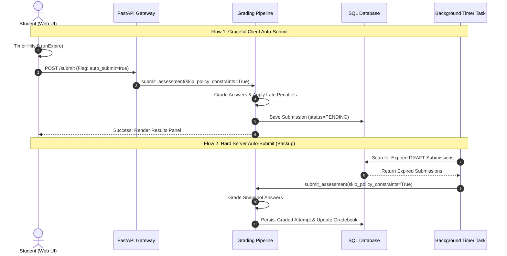

# Next-Gen Exam & Testing Refactoring Plan

This document presents a critical architectural analysis of the current assessment/exam engine and details a comprehensive implementation plan to rebuild the testing user experience (UX) and backend state-machine for a world-class, production-ready Learning Management System (LMS).

---

## 1. Executive Summary

The current assessment implementation suffers from critical design flaws, structural bugs, and incomplete logic that directly compromise data integrity, concurrency, and user experience. 

Most notably:
- **Timer expiration results in data loss**: Normal students are blocked from submitting their work once their exam timer expires.
- **Worker auto-submissions bypass grading**: The background task that auto-submits expired exams does a direct database column update, completely bypassing the grading and analytics pipeline.
- **Concurrency lock collision**: Student autosaves and teacher grading actions compete for the exact same version control lock, causing frequent and preventable database conflicts.
- **Lack of offline resilience**: Transient connection losses lead to draft save failures and overwritten progress.

This plan details a complete refactoring of the state machine, API layer, and frontend architecture to introduce decoupled concurrency locks, robust auto-submission pipelines, offline-first answer synchronization, and modern visual cues.

---

## 2. Critical Analysis of Current Flaws

Based on research into the codebase, the following critical issues have been identified:

### Issue A: Timer Expiration Blocks Submissions (High Severity)
- **Files**: [attempt_service.py](file:///x:/projects/ashyq-bilim/apps/api/src/services/assessments/attempt_service.py#L279-L290), [enforce.py](file:///x:/projects/ashyq-bilim/apps/api/src/services/grading/pipeline/enforce.py#L91-L111)
- **Flaw**: When a timed exam expires, the frontend triggers `submit` via standard endpoints. The backend runs the request through the `enforce_time_limit` check. Since the timer has expired, the server throws `403 FORBIDDEN` with code `TIME_LIMIT_EXPIRED`.
- **Impact**: Normal students who run out of time are blocked from submitting. Their attempt is stuck in `DRAFT` status, and their answers are never recorded or graded.

### Issue B: Worker Auto-Submissions Bypass Grading Pipeline (High Severity)
- **Files**: [assessment_timer.py](file:///x:/projects/ashyq-bilim/apps/api/src/tasks/assessment_timer.py#L112-L126)
- **Flaw**: The background task `_auto_submit_expired_drafts` changes the DB status of expired drafts to `PENDING` directly in SQL.
- **Impact**: These auto-submitted attempts are **never graded**. Auto-grader scripts are bypassed, the student's final score remains `None`, the gradebook is not updated, activity progress is not marked complete, and events (such as gamification XP rewards) are never emitted.

### Issue C: Concurrency Lock Collision (Medium Severity)
- **Files**: [submissions.py](file:///x:/projects/ashyq-bilim/apps/api/src/db/grading/submissions.py#L461-L468), [attempt_service.py](file:///x:/projects/ashyq-bilim/apps/api/src/services/assessments/attempt_service.py#L221), [_shared.py](file:///x:/projects/ashyq-bilim/apps/api/src/services/assessments/_shared.py#L1207-L1226)
- **Flaw**: The `Submission` model defines `draft_version` (to manage student draft saves) and `version` (for teacher grading locks). However, the draft-saving service (`save_assessment_draft`) increments and enforces `draft.version` instead of `draft.draft_version`.
- **Impact**: Student autosaves collide with teacher grading actions. Additionally, if the student has multiple tabs open, transient saves return `409 CONFLICT` unnecessarily, disrupting the exam flow.

### Issue D: Primitive Offline Handling & Overwrite Risk (Low/Medium Severity)
- **Files**: [useAssessmentSubmission.ts](file:///x:/projects/ashyq-bilim/apps/web/src/features/assessments/hooks/useAssessmentSubmission.ts#L170-L224), [ExamAttemptContent.tsx](file:///x:/projects/ashyq-bilim/apps/web/src/features/assessments/registry/exam/ExamAttemptContent.tsx#L347-L377)
- **Flaw**: The client autosaves every 5 seconds. If the user is offline, the save fails, and the UI shifts to an `error` state. Although local answers are stored in `localStorage`, there is no automatic retry queue or offline-first synchronization strategy.
- **Impact**: If a student experiences a brief network outage and reloads, they may get a raw dialog to override the server's version, risking data overwrites or duplicate active submissions.

---

## 3. Next-Gen Architecture & Refactoring Plan

The refactored assessment engine will split responsibilities cleanly between the frontend, API, grading orchestrator, and background tasks.



---

## 4. Backend Refactoring Plan

### 4.1. Decoupled Concurrency Locks
We will enforce the separation of the student's draft concurrency lock (`draft_version`) from the teacher's grading lock (`version`).

1. **Update API Headers**:
   - For student operations (`PATCH /draft`, `POST /submit`), validation of `If-Match` must verify and increment `draft_version`.
   - For teacher grading operations (`PATCH /submissions/{id}`), `If-Match` must verify and increment `version`.

2. **Modify Draft Services**:
   - In `save_assessment_draft` ([attempt_service.py](file:///x:/projects/ashyq-bilim/apps/api/src/services/assessments/attempt_service.py)), increment `draft.draft_version` instead of `draft.version`.
   - In `_enforce_draft_version` ([_shared.py](file:///x:/projects/ashyq-bilim/apps/api/src/services/assessments/_shared.py)), validate `draft.draft_version` against the expected value.

### 4.2. Graceful Time-Limit Submissions
We must allow a draft to be submitted after its timer has expired, provided no new edits are accepted.

1. **Modify `/submit` API Endpoints**:
   - Introduce a query parameter `/submit?auto_submit=true`.
   - On the backend, when `auto_submit=true` or when the backend detects the time limit has expired during a submission:
     1. Discard any answer updates included in the payload (only submit what is currently saved in the DB draft).
     2. Call `submit_assessment_pipeline` with `skip_policy_constraints=True` to bypass the time limit block.
     3. Write `"TIME_EXPIRED"` to the metadata's `auto_submit_reason`.

2. **Integrate Background Task with Grading Orchestrator**:
   - Refactor `_auto_submit_expired_drafts` in [assessment_timer.py](file:///x:/projects/ashyq-bilim/apps/api/src/tasks/assessment_timer.py).
   - Instead of running a direct SQL update (`_force_submit`), retrieve the student's draft, load the settings, and invoke `submit_assessment_pipeline` asynchronously.
   - Example implementation outline:
     ```python
     # Inside apps/api/src/tasks/assessment_timer.py
     from src.services.grading.pipeline.orchestrator import submit_assessment as submit_assessment_pipeline
     from src.services.grading.settings_loader import load_activity_settings

     async def _auto_submit_expired_drafts_async():
         # 1. Fetch expired drafts
         # 2. For each draft:
         #    user = get_user(draft.user_id)
         #    settings = load_activity_settings(draft.activity_id, ...)
         #    await submit_assessment_pipeline(
         #        activity_id=draft.activity_id,
         #        assessment_type=draft.assessment_type,
         #        answers_payload=draft.answers_json,
         #        settings=settings,
         #        current_user=user,
         #        db_session=db_session,
         #        submission_uuid=draft.submission_uuid,
         #        skip_permission=True,
         #        skip_policy_constraints=True, # Bypasses time limits gracefully
         #    )
     ```

---

## 5. Frontend Refactoring Plan

### 5.1. Robust Offline Synchronization Queue
We will update `useAssessmentSubmission.ts` to implement a queue-based autosave system that recovers gracefully from offline states.

1. **State Engine**:
   Introduce a state variable `syncQueue` mapping question IDs to their pending unsaved answers.
2. **Offline Interceptor**:
   - In the `setItemAnswer` callback:
     - Save the updated answer to `localStorage` immediately.
     - Append the update task to `syncQueue`.
     - If the navigator is offline, mark `saveState` as `'unsaved'` (without throwing error notifications).
3. **Flush mechanism**:
   - Listen to window `online` events.
   - When online, flush the queue sequentially by dispatching a single `PATCH /draft` request with the accumulated changes.

### 5.2. Visual Conflict Resolution Dialog
When a student logs in, if a local draft exists in `localStorage` that has a higher timestamp/version than the server, show a split comparison card instead of a raw override message.

- Render the two versions side-by-side (showing the question, the local answer, and the server answer).
- Provide two clear CTAs:
  - **"Merge & Keep Local"**: Uploads local answers to the server.
  - **"Discard & Use Server"**: Clears local storage and loads the server's state.

### 5.3. Exam Integrity & Tab Switching Warnings
To make the anti-cheat tab-switching trigger less jarring, introduce a warning countdown before submitting.

- **Tab Switching Warning**:
  - The first tab-switch violation triggers a subtle toaster warning: *"Warning: You navigated away from the exam tab. Your exam will be auto-submitted if this occurs again."*
  - The second violation displays a persistent, full-page overlay with a 10-second countdown: *"Security violation detected. Auto-submitting exam in 10s. Return to fullscreen immediately to cancel."*
  - Entering fullscreen stops and clears the countdown (up to the max threshold allowed).

---

## 6. Database and API Schema Verification

Below is the verification plan for the database schema:

| Entity | Action | Target Column / Field | Reason |
| :--- | :--- | :--- | :--- |
| `Submission` | Enforce | `draft_version` | Used for all client autosave `If-Match` headers. |
| `Submission` | Enforce | `version` | Used only for teacher grading overrides. |
| `SubmissionMetadata` | Add | `auto_submit_reason` | Trace why the attempt was closed (e.g. `"TIME_EXPIRED"`, `"INTEGRITY_VIOLATION"`). |

---

## 7. Verification and Testing Plan

To ensure the refactored code is production-ready, we will follow these validation steps:

### 7.1. Automated Unit & Integration Tests
- **Timer Expiration Test**:
  Create a test where a draft's `started_at` is set to 2 hours ago for an exam with a 1-hour time limit. Invoke `/submit` with `auto_submit=true` and verify the submission completes successfully with a computed score.
- **Worker Pipeline Test**:
  Run `_auto_submit_expired_drafts` on an expired draft. Assert that the submission is graded, its final score is populated, and its status is set to `PENDING` (or `GRADED`/`PUBLISHED` depending on policy).
- **Lock Collision Test**:
  Simulate concurrent saves by a student and grading by a teacher. Verify that saving drafts checks/increments `draft_version`, while teacher grading checks/increments `version`.

### 7.2. Manual E2E Validation
1. Start an exam with a 10-second time limit.
2. Let the timer expire.
3. Verify that the frontend automatically calls submit, displays a loader, and seamlessly transitions to the results dashboard with correct scores.
4. Go offline, change several answers, wait, go online, and confirm the answers sync successfully.
