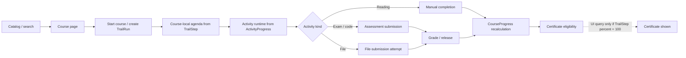
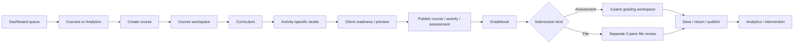

# Student & teacher workflow UX overhaul plan

**Audit date:** 2026-07-12  
**Scope:** Current student and teacher journeys across the Next.js frontend, FastAPI backend, database workflow models, permissions, API contracts, automated tests, and the locally runnable entry experience.  
**Relationship to the previous plan:** This supersedes the workflow priorities in `plans/lms-product-ux-roast-and-redesign-plan.md`. That plan correctly identified the missing work queue and status language. Some of it was implemented, but the implementation added presentation before resolving contradictory state models. This plan starts at the integrity layer.

## Implementation status — completed 2026-07-12

The actionable roadmap through Phase 7 is implemented. Phase 8 remains intentionally evidence-gated as specified by this plan; fake preview proof was removed, but speculative messaging and privacy-sensitive learner impersonation were not built.

- [x] Grade drafts are keyed to the loaded attempt, guarded on learner/page navigation, versioned on save, and covered by regression tests.
- [x] File review uses server search, status filters, 25-item pages, exact deep links, and reachable pagination.
- [x] Course and assessment preview UI no longer treats clicks or local storage as proof.
- [x] Course publication uses server readiness, optimistic concurrency, a dedicated lifecycle command, and an append-only audit event.
- [x] Learner course state, progress, outline, next action, and certificate state come from one backend read model; Trail is history only.
- [x] Start/enroll is idempotent; learner GET paths no longer repair progress.
- [x] Saved but unreleased grades cannot leak through feedback, completion, work queues, or certificate eligibility.
- [x] `/me/work` serves permission-filtered learner and teacher work with stable keyset cursors and exact review links.
- [x] Learner Home is grouped into Today, Due soon, Returned, Waiting, and Recently released; teacher work leads with grading and release decisions.
- [x] Dashboard work uses the learning-ledger row grammar instead of nested card stacks, with active-locale dates and localized workflow copy.
- [x] Gradebook defaults to 25 learners, retains the desktop matrix, and switches to a learner-first mobile review list.
- [x] Course creation is reduced to a private title-first draft with optional structure source.
- [x] Course authoring retains keyboard sorting and shared unsaved-work guards; lifecycle blockers link back to the relevant editor stage.
- [x] The public entry surface has an honest, localized degraded state when backend services are unavailable.
- [x] State ownership and invariants are recorded in `docs/adr/004-student-teacher-workflow-state-ownership.md`.
- [x] OpenAPI/client contracts were regenerated; 391 frontend tests, 211 backend tests, static checks, and the production build pass.

## Executive roast

Ashyq Bilim is not short on features. It is short on truth.

The product has course creation, curriculum authoring, assessments, code challenges, file submissions, grading, analytics, interventions, certificates, discussions, gamification, and AI. Each subsystem can render a plausible screen. The full workflow is still unreliable because those screens do not consistently agree about enrollment, availability, progress, submission state, grade release, readiness, or completion.

The result is an LMS that makes users operate the implementation:

- Students must know whether to look in the dashboard, catalog, course page, trail, activity shell, attempt history, or certificate panel.
- Teachers must know whether work lives in Courses, an activity studio, Gradebook, activity review, Analytics, or a separate file-submission review screen.
- A green badge often means “this component's local calculation passed,” not “the server guarantees this is ready.”
- “Preview complete” can mean “the link was clicked.”
- “Course complete” can differ between the course page, activity runtime, canonical progress table, and certificate service.
- A review screen can show one learner while retaining another learner's grading draft.

Visually, the system has graduated from random vibe-coded panels into disciplined shadcn-flavored panel soup. That is progress, but not good product design. The application is full of cards inside cards, borders around every thought, badges for metadata that should be hierarchy, uppercase micro-labels, and desktop-wide control surfaces squeezed onto mobile. The interface looks busier than the work actually is while still hiding the one action that matters.

The harsh summary:

> The current UI is a convincing mock of several LMS modules sitting on top of incompatible workflow models.

Do not start with a reskin. A prettier contradiction is worse because users trust it more.

## Audit confidence & runtime limitation

This audit used:

- Route and component inspection across the learner, teacher, assessment, grading, analytics, and certificate surfaces.
- FastAPI routers, services, persistence models, permissions, and progress/certificate logic.
- Current product documentation and the previous LMS redesign plan.
- Current student, teacher, grading, and assessment E2E specifications.
- A live local frontend review of `/en`, `/en/login`, and the application error state.
- `vp check`, targeted frontend workflow tests, and targeted backend workflow tests.

The complete authenticated browser journey could not run because Docker is unavailable and PostgreSQL was not listening on `localhost:5432`. The API correctly failed startup rather than pretending to be healthy. Runtime-dependent claims below are therefore clearly separated from code-confirmed findings.

Observed live behavior:

- `/en` failed as one generic “Something went wrong!” page when its server request could not reach the API. The only diagnostic shown to the user was an opaque reference number.
- `/en/login` rendered independently, but the experience is a sparse internal-looking form with an oversized logo, weak hierarchy, placeholder-driven input naming, and inconsistent “Login” versus “Sign in” terminology.

Validation baseline:

- `vp install`: passed with no dependency changes.
- `vp check`: passed with 0 errors and 2 React warnings.
- Targeted frontend workflow tests: 25 passed.
- Targeted backend student/activity/submission/grading/lifecycle tests: 64 passed with 1 deprecation warning.
- Full `vp test`: exceeded the 120-second execution window, so full-suite status is unknown.

Passing isolated tests do not disprove the cross-surface failures below. The largest defects exist between models and screens, exactly where the current test suite is weakest.

## Product scorecard

| Area                             | Score | Critical read                                                                                                                   |
| -------------------------------- | ----: | ------------------------------------------------------------------------------------------------------------------------------- |
| Student “what next?” clarity     |  2/10 | The learner dashboard queue is literally empty; course-local agenda is derived from legacy trail state.                         |
| Teacher “what needs me?” clarity |  4/10 | Some queue signals exist, but work is split across dashboard, analytics, gradebook, assessment review, and file review.         |
| Workflow state integrity         |  2/10 | Trail, activity progress, course progress, submissions, and certificates can disagree.                                          |
| Course authoring                 |  5/10 | Better shell and sections, but readiness is shallow, client-owned, and bypassable.                                              |
| Assessment authoring             |  6/10 | Strong shell/readiness direction; fake preview scenarios and fragmented save/publish semantics undermine trust.                 |
| Student assessment experience    |  6/10 | Substantial attempt, save, recovery, conflict, and timer work; anti-cheat and failure recovery remain overly client-dependent.  |
| Grading safety                   |  3/10 | Assessment grading has concurrency handling; file grading can retain the wrong learner's draft and exposes only the first page. |
| Mobile teacher UX                |  2/10 | Gradebook and multi-pane review are desktop-first, not responsively re-conceived.                                               |
| Accessibility & localization     |  4/10 | Useful primitives exist, but hardcoded English, raw motion, placeholder labels, and local status colors remain common.          |
| Visual coherence                 |  4/10 | More consistent than before, but generic, over-boxed, dense, and weakly prioritized.                                            |
| Test confidence                  |  4/10 | Good unit/service depth in pockets; the main cross-role E2E chain is serial, stateful, skip-prone, and weakly asserted.         |

## Current workflow maps

### Student journey today



The broken link is not subtle: the course page uses `TrailStep`; the canonical backend uses `ActivityProgress` and `CourseProgress`. Assessment and file-submission completion update canonical progress, not the trail. The certificate UI then waits for the legacy trail percentage before it even asks the server for a certificate.

### Teacher journey today



This is not one teacher workflow. It is a route map with handoffs. Status vocabulary, filters, pagination, save behavior, release behavior, and mobile layouts change at every handoff.

## P0 confirmed defects

### P0.1 The course page and backend disagree about completion

Evidence:

- `apps/web/src/features/learner-course/course-page-modules.tsx:419` builds completion from `trailData.runs[].steps`.
- `apps/web/src/features/learner-course/course-page-modules.tsx:330` only runs the certificate query when that trail-derived percent is 100.
- `apps/api/src/services/progress/submissions.py:220` defines canonical course progress from required `ActivityProgress` rows.
- `apps/api/src/services/progress/submissions.py:297` sets certificate eligibility from that canonical calculation.
- `apps/api/src/services/courses/certifications.py:565` explicitly says `CourseProgress`, not `TrailStep`, is canonical.

Impact:

- Students can complete an assessment or file submission and still see an incomplete course page.
- A valid certificate can exist or be eligible while the UI refuses to fetch it.
- “Continue” can select the wrong activity because it also uses trail completion.
- Support, analytics, and teachers can each see a different completion story.

Required action:

- Delete trail-derived progress from product decisions.
- Keep trail only as history/navigation compatibility until it can be removed.
- Serve course page progress, returned work, next action, and certificate state from one server-owned learner course state contract.

### P0.2 File-submission grading can apply stale draft state to the wrong learner

Evidence:

- `FileSubmissionReviewWorkspace` initializes `score`, `feedback`, and rubric state independently.
- The displayed `selected` attempt falls back to the first filtered row.
- Draft state is loaded only inside `selectAttempt()` after an explicit click.
- Search can change the fallback-selected learner without rehydrating the draft fields.
- The mutation submits the currently displayed `selected` UUID with whatever score/feedback remains in local state.

Impact:

- The first learner shown can be graded with blank fields even when a saved grade exists.
- Filtering can display learner B while the form still contains learner A's feedback.
- This is a data-integrity defect, not an inconvenience.

Required action:

- Derive one immutable `selectedAttemptUuid` from the URL.
- Key the grading form by attempt UUID.
- Hydrate/reset the form whenever the UUID changes.
- Block submission while the form's loaded UUID differs from the selected UUID.
- Add an integration test that switches A → B by click, search, URL navigation, and post-grade queue removal.

### P0.3 File review silently hides submissions after the first 25

Evidence:

- The API defaults to `page_size=25`.
- The frontend fetch helper calls the endpoint without page, status, or search parameters.
- Search runs only against the already-fetched page.
- The review UI exposes no pagination.

Impact:

- Teachers with 26+ submissions cannot reach every learner.
- Search can incorrectly claim no learner exists.
- Queue counts and visible rows disagree.

Required action:

- Add server-backed status, search, sort, page, and page-size parameters to the frontend query.
- Put them in the URL.
- Render total/page controls and retain selection across refetches.
- Prefer reusing the canonical grading queue components instead of maintaining a second review product.

### P0.4 Course publishing is a client-side suggestion, not a backend invariant

Evidence:

- Course readiness is computed in the client from title, description, thumbnail, any chapter/activity, any contributor, access, and any certificate.
- “Preview as learner” is marked complete by writing `1` to local storage when a link is clicked.
- `canPublish` exists only in the component.
- `update_course_access()` accepts `public=true` after a permission check and concurrency check; it does not run course readiness.

Impact:

- Another client or a direct API request can publish an unready course.
- Clearing or forging local storage changes the gate.
- The checklist does not verify activity publication, assessment readiness, broken content, outcomes, grading policy, or certificate rules.
- Requiring a contributor and certificate for every course creates false blockers while missing real blockers.

Required action:

- Remove `public` as a generic patchable field for publish transitions.
- Add server endpoints for readiness and lifecycle transition.
- Make deterministic blockers server-owned.
- Delete the fake preview completion gate now. Until real preview evidence exists, label the link honestly as “Open learner preview,” not “Preview complete.”

### P0.5 Assessment preview scenarios are simulated by state, not executed

Evidence:

- “Run preview” only adds a scenario ID to a React `Set`.
- No learner runtime, policy evaluation, timer, access, result, or API call is executed.
- High-stakes publish confirmation treats one clicked scenario as successful preview evidence.

Impact:

- The most safety-sensitive assessments receive the most misleading gate.
- Teachers are taught that a decorative action is verification.

Required action:

- Delete preview scenarios from blocking logic immediately.
- Phase 1: publish uses only deterministic readiness plus an explicit impact confirmation.
- Phase 2: build a real server-produced preview runtime for generic learner states.
- Do not add “specific learner” preview until authorization, privacy, and impersonation audit requirements are designed.

### P0.6 The learner dashboard is knowingly empty

Evidence:

- `buildLearnerSection()` returns `items: []`.
- Its empty copy says learner feeds are still being connected.

Impact:

- The product's home screen cannot answer the student's primary question.
- Learners must browse courses and reconstruct urgency themselves.

Required action:

- Ship a backend `/me/work` aggregate before adding more dashboard decoration.
- Include due, overdue, continue, returned, feedback released, waiting for grade, blocked, and certificate-ready states.
- Sort by a documented priority function; do not fabricate work from incomplete client data.

### P0.7 Access, enrollment, visibility, and “started” are conflated

Current semantics include:

- `course.public` for catalog/read behavior.
- Linked user groups for eligibility.
- “No linked groups” interpreted as open enrollment even for a private course.
- `TrailRun` used by the UI as enrollment/start state.
- Activity `published` and assessment/file-submission lifecycle as separate availability gates.

Impact:

- “Private” does not have one user-understandable meaning.
- Starting a course is not clearly the same as or different from enrolling.
- The activity outline can include unpublished activities because the runtime loads all course activities.
- Permission and lock failures are discovered late, inside activities.

Required action:

- Define these server-owned concepts separately:
  - catalog visibility
  - access eligibility
  - enrollment/start state
  - content availability
  - required/optional completion
  - assessment attempt eligibility
- Return the evaluated reason and allowed action in read models.
- Filter learner outlines to learner-visible activities only.

### P0.8 A GET request mutates canonical progress

Evidence:

- Student activity runtime reads call `recalculate_course_progress(..., commit=True)`.

Impact:

- A read endpoint writes to the database.
- Cache/retry/load behavior can have side effects.
- Latency and failure modes become harder to reason about.

Required action:

- Update progress transactionally on state-changing commands.
- Add a repair/rebuild command for backfills and operational healing.
- Keep GET read-only; if temporary read repair is unavoidable, perform it explicitly and instrument it rather than hiding a commit in serialization.

### P0.9 The root product page has no degraded mode

Observed behavior:

- When platform data failed to load, `/en` collapsed to the route error boundary.
- The user received no service status, catalog fallback, sign-in path, or actionable diagnosis.

Required action:

- Split shell/marketing content from live platform data.
- Stream independent sections with scoped error states.
- Render a stable entry page even when recommendations/catalog APIs fail.
- Show “Courses are temporarily unavailable” with Retry and Sign in, while logging the reference privately.

## Student workflow critique & redesign

### 1. Discover & decide

Current problems:

- Catalog, search, collections, trail, dashboard, and course page are separate mental models.
- The course page combines a new learner agenda, old brochure content, legacy progress widgets, discussions, AI, media, curriculum, and teacher controls.
- Non-enrolled and enrolled users share too much structure.
- Starting unauthenticated sends the learner to sign-up, not sign-in with a preserved return intent.

Target experience:

- Catalog card answers: what is it, who is it for, effort, outcomes, access, and one CTA.
- Enrolled course row answers: current status, next action, due state, and progress.
- Course page has two explicit modes:
  - **Preview mode:** outcome, syllabus, teacher, effort, assessment/certificate policy, eligibility, Enroll/Start.
  - **Learning mode:** next action, due/returned work, canonical progress, feedback, certificate state; marketing content is secondary.
- Authentication preserves `returnTo` and distinguishes Sign in from Create account.

Acceptance criteria:

- A new learner can decide whether to start without opening multiple accordions.
- An enrolled learner sees the next valid action above all descriptive content.
- A private/ineligible course explains why and who can fix access.

### 2. Enroll / start

Current problems:

- `TrailRun` is treated as enrollment but named and modeled as a trail run.
- Duplicate start returns an error rather than an idempotent current state.
- Access evaluation is not presented as a single contract.

Target API:

```text
GET  /api/v1/courses/{course_uuid}/learner-state
POST /api/v1/courses/{course_uuid}/enrollment
```

The POST is idempotent and returns the same `LearnerCourseState` as the GET.

Minimal implementation rule:

- Reuse current tables behind an adapter first.
- Do not add a new enrollment table until audit/roster requirements prove `TrailRun` cannot safely carry the transition.
- Stop exposing Trail terminology to product components immediately.

### 3. Resume & navigate

Current problems:

- “Next” is the first incomplete activity, not necessarily the first available or highest-priority activity.
- Course-local agenda ignores cross-course due work.
- The runtime outline can include unpublished content.
- Activity numbering resets within chapters in the course agenda.

Target behavior:

- Server returns `next_action` with activity UUID, label, reason, due state, and blocked state.
- Next-action precedence:
  1. returned revision
  2. overdue available work
  3. in-progress attempt
  4. due soon required work
  5. next available required activity
  6. optional activity
  7. completion/certificate review
- Outline shows locked items only when seeing the sequence helps; unpublished items never appear.
- Lock cards explain prerequisite, date, attempt policy, or access owner and expose the only valid next action.

### 4. Complete learning content

Current problems:

- Reading completion is gated by reaching the content bottom, which is a scroll heuristic rather than evidence of learning.
- Missing content container marks reading complete automatically.
- Manual completion and assessment completion travel through different persistence paths.

Target behavior:

- “Mark complete” remains an explicit learner action for reading/video/document activities.
- Scrolling may enable the action as a lightweight acknowledgement, but never silently completes work.
- All completion commands update `ActivityProgress`, then recalculate `CourseProgress` in the same transaction/outbox flow.
- Trail history is updated asynchronously as non-canonical history if still needed.

### 5. Submit files

Current strengths to preserve:

- Upload progress, local slot states, validation messages, draft/submitted/graded/released states, receipt, and attempt history.

Current problems:

- Persisted files cannot be removed or replaced from the draft UI.
- Save draft is disabled when there are no new local slots, even if persisted file changes eventually need saving.
- Upload starts a draft as a side effect of choosing a file.
- Submit has no final impact review listing files, due/late status, and attempt consumption.
- Partial upload success and retry semantics are unclear.

Target behavior:

- A file list supports Add, Replace, Remove, Retry, and Open before submission.
- Draft creation is invisible/idempotent; choosing files does not feel like a workflow transition.
- Submit confirmation lists files, attempt number, due/late state, and whether resubmission remains possible.
- Failed slots remain retryable; successful slots are not uploaded again.
- Leaving with queued/failed/unsaved slots triggers an unsaved-work guard.

### 6. Take assessments

Current strengths to preserve:

- Server-authoritative expiry support, answer autosave, local recovery, optimistic conflict handling, question navigation, flags, attempt history, and explicit submit dialog.

Current problems:

- Two simultaneous save stories—local 5-second persistence and server 1-second save—are hard for users and developers to reason about.
- Submit failures collapse to a generic toast with no durable recovery action.
- Anti-cheat controls are primarily browser observations and can auto-submit from client events.
- Mobile smoke coverage only asserts that `<body>` exists.

Target behavior:

- Show one save status derived from server state, with local recovery described only when needed.
- On submit failure, keep the attempt open, preserve answers, show Retry, and distinguish offline, conflict, expired, and policy errors.
- The server decides whether an attempt is expired or invalid. Client guard events are evidence, never sole authority.
- High-stakes policies must declare browser support and an accommodation path.
- Mobile design keeps question, navigation, timer, and submit reachable without overlapping fixed bars.

### 7. Wait, receive feedback, revise

Current problems:

- Waiting, graded-hidden, published, returned, passed, failed, and complete appear differently across course page, activity strip, attempts, gradebook, and file submissions.
- Returned work on the course page is inferred from optional activity fields rather than the canonical runtime.
- Feedback has no global inbox.

Target behavior:

- `/me/work` supplies `waiting_for_grade`, `feedback_released`, and `returned_for_revision` items.
- Course state includes canonical counts and deep links.
- Returned work leads directly to the editable attempt and teacher feedback.
- A learner can acknowledge feedback; acknowledged feedback leaves the urgent queue but remains in history.

### 8. Complete course & receive certificate

Target behavior:

- Course completion is read directly from `CourseProgress`.
- Certificate eligibility and issuance are visible separately:
  - requirements incomplete
  - eligible, generation pending
  - issued
  - unavailable because the course has no certificate configuration
  - revoked
- The certificate page lists evidence: required activities, assessment results, issuer, issue date, and verification ID.
- Fetch certificate state regardless of a client-computed percentage.

## Teacher workflow critique & redesign

### 1. Start with work, not sections

Current strengths:

- The dashboard now assembles course readiness, grading backlog, SLA, risk, and admin signals.

Current problems:

- It still has no canonical work API.
- It exposes raw service error messages inside queue descriptions.
- Queue copy is hardcoded English despite a 3-locale product.
- Assessment backlog links into Analytics rather than directly into the grading queue.
- Discussion questions, scheduled releases, returned revisions, and failed bulk actions are absent.

Target endpoint:

```text
GET /api/v1/me/work?role=teacher&status=open&cursor=...
```

Each item contains:

```ts
type WorkItem = {
  id: string
  kind: string
  priority: 'critical' | 'high' | 'normal' | 'low'
  title: string
  reasonCode: string
  course?: { uuid: string; title: string }
  learner?: { uuid: string; displayName: string }
  dueAt?: string
  ageSeconds?: number
  href: string
  allowedActions: string[]
}
```

Messages are localized in the frontend from stable reason codes. Internal exception text is logged, not shown.

### 2. Create a course

Current problems:

- Four boxed sections plus a sticky summary make a simple creation task feel heavier than it is.
- Visibility and destination choices appear before the teacher has content.
- “Copy outline” creates partial-success complexity during the first action.

Target experience:

- Default creation asks only for title and optional source template.
- Course is always created private/draft.
- Redirect immediately to Course Studio with a short setup checklist.
- Description, access, media, certificate, and publish decisions live in the studio where context exists.
- Keep advanced copy/import as a secondary action with a durable import report.

### 3. Build curriculum

Current problems:

- Curriculum editing, activity settings, activity studio, and assessment studio feel like separate products.
- Publish controls exist at course, activity, assessment, and file-submission levels with different meanings.
- Drag-and-drop receives more E2E attention than recovery, conflict, keyboard reordering, or empty content.

Target behavior:

- Curriculum outline is the course spine: chapter, activity, lifecycle, readiness, learner count, due state.
- Selecting an activity opens an editor workspace without losing outline context.
- Add activity starts with the pedagogical task: Teach content, Collect work, Check understanding, Run code—not backend enum names.
- Keyboard reorder and explicit Move actions are first-class; drag-and-drop is an enhancement.
- One save ledger covers outline and selected editor state.

### 4. Configure assessments

Current strengths:

- Assessment studio has a useful navigation model, readiness strip, save ledger, item authoring, access view, results, and publish view.

Current problems:

- Readiness messages compete with persistent chrome and local panels.
- Publish preview is fake.
- Raw amber/lime/blue styling defines states locally.
- Audit note is shown for high-stakes changes but is not necessarily required by the confirmation gate.

Target behavior:

- Server returns readiness issues with code, severity, scope, exact item UUID, and resolvable view.
- Blockers appear once in a compact issue rail; selecting one focuses the exact field.
- Publishing is a server transition with optimistic concurrency and required audit note for configured high-stakes policies.
- Preview is a real learner runtime or removed from the gate.

### 5. Publish a course

Server contract:

```text
GET  /api/v1/courses/{course_uuid}/readiness
POST /api/v1/courses/{course_uuid}/lifecycle
```

Readiness categories:

- **Blocking integrity:** no learner-visible activities, unpublished required activity, unready assessment, inaccessible file, invalid access policy, broken prerequisite, invalid grading policy.
- **Warnings:** missing thumbnail, missing outcomes, no certificate, no contributor, no due dates, low content variety.
- **Advice:** copy quality, estimated duration, optional enhancements.

Rules:

- Thumbnail, contributor, and certificate are never universal blockers.
- Every blocker is deterministic and server-verifiable.
- Lifecycle transition re-runs readiness transactionally.
- Publish response returns affected learner count and active/scheduled content count.

### 6. Find grading work

Current problems:

- Dashboard → Analytics → assessment detail is an unnecessary detour.
- Gradebook tries to be overview, queue, analytics, and matrix simultaneously.
- `PAGE_SIZE=100` plus all visible activities creates a potentially massive cell grid.
- The existing cursor gradebook endpoint is not used by the UI.

Target experience:

- Teacher Home owns the cross-course queue.
- Course Gradebook owns cohort overview and learner/activity drill-down.
- Activity Review owns high-throughput grading.
- Analytics owns trends and interventions, not routing to ordinary grading.

### 7. Use the gradebook

Desktop target:

- Default to a learner list with summary columns and action counts.
- Matrix is an explicit view for comparison.
- Paginate learners at 25–50; window or filter activities.
- Use the existing cursor endpoint if measured matrix size requires incremental cells.

Mobile target:

- Never squeeze a 980px matrix into horizontal scroll as the primary experience.
- Show learner cards/rows → learner detail → activity result.
- Bulk selection is desktop/tablet only unless a mobile use case is proven.

### 8. Grade & release

Target unified review shell:

- Queue pane: server search/filter/sort/page, age, late state, release state.
- Work pane: kind-specific submission evidence.
- Decision pane: rubric/item score, overall feedback, return/save/publish.
- URL owns filter, sort, page, and selected submission.
- All forms are keyed to submission UUID and protected by version/ETag.
- Moving to the next item is explicit after save; the UI never silently reuses a draft.

Migration approach:

1. Fix file review selection safety and pagination in place.
2. Extract common queue, status, selection, and decision contracts.
3. Mount file evidence as a `ReviewDetail` adapter in the canonical grading shell.
4. Retire the separate file-review product only after parity tests pass.

### 9. Intervene

Current analytics is feature-rich but still report-heavy.

Target closed loop:

- Risk row → view evidence → choose intervention → create/assign → track outcome.
- Supported first actions: extend deadline, assign remediation, add to watchlist, open learner grade history.
- Do not build messaging until delivery, consent, and audit requirements are defined.
- Work items close only when the underlying state changes, not when a teacher dismisses a card.

## Canonical backend product model

### One learner course read model

Add a `LearnerCourseState` response assembled server-side:

```ts
type LearnerCourseState = {
  course: { uuid: string; title: string; visibility: string }
  access: { eligible: boolean; reasonCode?: string }
  enrollment: { state: 'not_started' | 'active' | 'completed'; startedAt?: string }
  progress: {
    completedRequired: number
    totalRequired: number
    percent: number
    needsGrading: number
    returned: number
  }
  nextAction: {
    kind: string
    activityUuid?: string
    labelCode: string
    reasonCode: string
  } | null
  certificate: {
    state: 'ineligible' | 'eligible' | 'issuing' | 'issued' | 'not_configured' | 'revoked'
    verificationUuid?: string
  }
  chapters: Array<{
    id: number
    title: string
    activities: Array<{
      uuid: string
      title: string
      type: string
      required: boolean
      state: string
      available: boolean
      reasonCode?: string
      dueAt?: string
    }>
  }>
}
```

This replaces client joins over course metadata, trail, optional activity fields, certificate queries, and local heuristics.

### One transition vocabulary

Keep storage enums where migration risk is high, but normalize at API boundaries:

| Product state   | Student meaning                       | Teacher next action         |
| --------------- | ------------------------------------- | --------------------------- |
| `not_started`   | Available, untouched                  | None                        |
| `in_progress`   | Draft/attempt exists                  | None                        |
| `submitted`     | Received, not graded                  | Grade                       |
| `needs_grading` | Waiting for manual decision           | Grade                       |
| `graded_hidden` | Graded, not released                  | Release                     |
| `returned`      | Feedback requires revision            | Wait for resubmission       |
| `published`     | Result visible                        | None/correct                |
| `passed`        | Requirement satisfied                 | None                        |
| `failed`        | Result visible, policy decides retake | Review policy               |
| `complete`      | Non-scored requirement satisfied      | None                        |
| `locked`        | Cannot act yet                        | Resolve prerequisite/policy |

Each response includes allowed actions. Components do not reverse-engineer transitions from strings.

### Command/query separation

- GET endpoints are read-only.
- Commands are idempotent where a repeated click is normal.
- Publish, submit, grade, return, release, enroll, and complete commands require a version/idempotency key as appropriate.
- Progress and work-queue projections update in the same transaction or via a durable outbox.
- Repair jobs can rebuild projections; ordinary reads do not silently commit repairs.

### Permission model

Centralize evaluators for:

- `can_discover_course`
- `can_access_course`
- `can_enroll_course`
- `can_view_activity`
- `can_attempt_assessment`
- `can_review_submission`
- `can_publish_course`

Return stable denial reason codes. Do not repeat access logic in course, assessment, file-submission, AI, and analytics services.

## Information architecture

Recommended routes preserve current public URLs where possible:

```text
/dash                         Role-aware Home
/learn                        Optional alias/redirect to learner Home
/courses                      Catalog
/course/:course               Preview or learning overview
/course/:course/activity/:id  Student activity runtime

/dash/courses                 Teacher course list
/dash/courses/:course         Course Studio overview
/dash/courses/:course/curriculum
/dash/courses/:course/gradebook
/dash/courses/:course/learners
/dash/courses/:course/review  Server readiness/publish
/dash/review                  Cross-course grading queue
/dash/review/:submission      Optional stable detail route
/dash/analytics               Trends/interventions
```

Rules:

- Dashboard is Home, not a section directory.
- Grade work never requires a detour through Analytics.
- `_shared/withmenu` route ancestry is migrated into feature-owned components over time; do not do a flag-day move.
- Public shell and dashboard shell share account, locale, theme, and global search behavior.

## Visual & interaction direction

### Product character

Subject: a serious multilingual education operations platform for Kazakh learners and teachers. The visual tone should be calm, literate, evidence-led, and humane—not a generic SaaS admin, a marketplace, or a gamified toy.

### Signature interaction: the learning ledger

Use one repeated structural device across roles:

```text
┌ Priority / due ─ State ─ Object ─ Why now ───────── Next action ┐
│ Today            Returned  Python essay  Feedback…  Revise       │
│ 2d overdue       Review    Final project  18 files   Grade next   │
└───────────────────────────────────────────────────────────────────┘
```

The ledger is not another Card component. It is a compact row/list grammar that encodes time, state, evidence, and action. Learner density is lower; teacher density is higher. This becomes the recognizable product signature because it reflects the actual work.

### Keep the existing foundation

- Keep the existing semantic theme tokens and current fonts during workflow repair.
- Keep Inter/Source Serif/JetBrains Mono; font churn will not fix hierarchy.
- Keep shadcn/base primitives, but stop turning every group into a bordered Card.
- Keep restrained blue as the action color.

### Refined semantic palette

Use theme tokens backed by these roles, not raw component classes:

- `ink` — deep navy/charcoal for primary text.
- `canvas` — cool near-white/dark neutral background.
- `action` — existing brand blue for primary interaction.
- `success` — muted teal/green only for completed/valid states.
- `attention` — amber only for work that needs a person.
- `danger` — red only for destructive, failed, overdue-critical, or integrity risk.

Do not use lime, amber, blue, and rose as local decoration. A status gets its color from the global state model.

### Layout rules

- One page-level surface; use dividers, whitespace, and type before nested cards.
- One primary action per region.
- Badges are for compact state, not every piece of metadata.
- Uppercase eyebrow text is rare and never the main hierarchy.
- Teacher tables use sticky context and deliberate density.
- Mobile switches information architecture instead of shrinking desktop grids.
- Fixed bars include safe-area padding and never cover the last action/content.

### Motion rules

- Remove `transition-all`; specify color, opacity, or transform.
- No pulsing active-route dots.
- Honor reduced motion for progress, panels, reordering, and scroll.
- Motion communicates save, reorder, open/close, or state transition only.

### Copy rules

- Use one verb consistently: Sign in, Enroll, Start, Submit, Save draft, Return for revision, Publish result.
- Never expose internal exception text in user descriptions.
- Disabled actions show a nearby reason or are omitted.
- Error messages say what happened, whether work is safe, and the next action.
- All product copy lives in `en-US`, `ru-RU`, and `kk-KZ` messages; no page-level English constants.

## Accessibility requirements

- Auth inputs use semantic `<label>`, `name`, `type`, and autocomplete values; placeholders are examples, not names.
- Add a skip link and verify heading hierarchy in both shells.
- Icon-only controls have accessible names and decorative icons are hidden.
- All asynchronous save/error/status updates use appropriate live regions without toast-only communication.
- Drag operations have keyboard Move before/after/to chapter alternatives.
- Unsaved authoring and queued uploads guard route change, refresh, and tab close.
- Assessment interactions meet keyboard and screen-reader requirements for question groups, validation, navigation, timer warnings, and submission review.
- Large tables expose captions/headers and have a non-matrix mobile alternative.
- Long Russian and Kazakh strings are tested; truncation never hides the only differentiating information.
- Dates/numbers use the active locale, not environment-default `undefined` locale.
- Touch targets are at least 44×44 where actions are primary.

## Implementation roadmap

### Phase 0 — Stop lying & stop data-risk defects (3–5 days)

Deliverables:

- Fix file-review form rehydration/keying and add selection safety invariant.
- Add real server pagination/search/filter to file review.
- Remove course and assessment fake “preview passed” gates.
- Stop showing raw dashboard exception messages.
- Add degraded `/en` entry state.
- Document current state ownership in an ADR.

Exit criteria:

- A grade cannot be saved for a UUID different from the form's loaded UUID.
- Every file submission is reachable.
- Clicking Preview does not claim verification.
- Backend publish bypass is captured by a failing test ready for Phase 2.

### Phase 1 — Canonical learner state (1–2 weeks)

Backend:

- Add `LearnerCourseState` assembler and endpoint.
- Compute next action from `ActivityProgress`, policies, availability, and canonical submissions.
- Include certificate state and learner-visible outline.
- Make enrollment/start idempotent.
- Remove write-on-GET progress recalculation.

Frontend:

- Replace trail-derived progress/next/returned/certificate logic on the course page.
- Adapt `StudentActivityWorkspace` outline/header/action bar to the same read model.
- Keep Trail UI as history only.

Tests:

- Reading + exam + file course reaches 100% once.
- Returned work reduces completion/changes next action as policy defines.
- Released grade and certificate appear without a trail step.
- Unpublished activity never appears to a learner.

### Phase 2 — Server-owned lifecycle & readiness (1–2 weeks)

Backend:

- Add course readiness response and lifecycle transition.
- Enforce readiness when publishing.
- Normalize activity/assessment/file lifecycle blockers.
- Add version/audit metadata.

Frontend:

- Render server issues by severity with deep links.
- Convert client readiness to a temporary display adapter, then delete it.
- Replace local-storage preview completion with honest preview navigation.

Tests:

- Direct API cannot publish a blocked course.
- Concurrent publish returns conflict.
- Warnings do not block.
- Required unready assessment blocks the exact course with an exact deep link.

### Phase 3 — Learner Home & work API (1–2 weeks)

Backend:

- Add `/me/work` projection/query.
- Produce learner work from canonical progress/submissions/policies/certificates.

Frontend:

- Replace empty learner queue.
- Add compact sections: Today, Due soon, Returned, Waiting, Recently released.
- Keep Browse as secondary.

Tests:

- Priority ordering is deterministic.
- Empty state means truly no open work.
- One click reaches the exact actionable state.

### Phase 4 — Teacher Home & cross-course review queue (1–2 weeks)

Backend:

- Extend `/me/work` for grading, release, course blockers, risk, and failed bulk jobs.
- Cursor paginate and provide stable reason codes.

Frontend:

- Link grading items directly to selected submission.
- Add saved URL-backed views: Needs grading, Awaiting release, Returned revisions, Late, SLA breach.
- Move current Browse tools below the ledger.

Tests:

- Oldest actionable submission opens in one click.
- Permission filtering never leaks inaccessible course/learner metadata.
- Queue closes/reprioritizes after grade/release.

### Phase 5 — Unify grading safely (2 weeks)

- Extract canonical queue selection and decision contracts.
- Move file evidence into the main grading shell through a kind adapter.
- Keep file upload-specific preview/download UI.
- Standardize status, concurrency, return, release, audit notes, keyboard commands, and next-item behavior.
- Remove the old file review only after fixture parity.

### Phase 6 — Gradebook responsive redesign (1 week)

- Default to learner summary list.
- Keep Matrix as an explicit desktop view.
- Use 25–50 learner pages and activity filters/windows.
- Reuse cursor endpoint only if measured data volume requires it.
- Build mobile learner detail instead of a horizontally scrolling matrix.

### Phase 7 — Course Studio simplification (1–2 weeks)

- Reduce creation to title + optional template.
- Make the curriculum the persistent spine.
- Standardize authoring chrome/save/conflict/preview.
- Replace enum-oriented activity creation with task-oriented choices.
- Add keyboard moving and unsaved guards.

### Phase 8 — Real preview & intervention loops (later, evidence-driven)

- Build real generic learner preview runtime if teachers need it after deterministic readiness ships.
- Add intervention state and outcome tracking.
- Add specific-learner preview only after privacy/audit design.
- Add messaging only after delivery and governance requirements exist.

## Testing strategy

### Replace the fragile E2E chain

Current journey specs share environment variables across serial files, conditionally skip after missing setup, use broad regex locators, and sometimes assert only body visibility. This makes downstream skips look less alarming than the first failure.

New structure:

- Seed each scenario through a typed API fixture, not UI creation in a previous spec.
- Keep one small UI authoring smoke; do not make every learner test depend on drag-and-drop course creation.
- Never skip a required workflow because an ID is missing; fixture setup must fail the scenario.
- Use stable test IDs only for product contracts that lack a reliable role/name.
- Assert canonical state through both UI and API at transition boundaries.

Required E2E scenarios:

1. Student enrolls → reads → submits file → takes exam → waits → receives returned work → resubmits → receives released grades → certificate.
2. Teacher creates draft → authors content/assessment → resolves readiness → publishes → sees learner work → grades → returns → releases.
3. File review switches between learners without carrying state.
4. 30 file submissions are searchable and pageable.
5. Course publish blocked through UI and direct API.
6. API outage leaves entry/login/help surfaces usable.
7. Mobile student attempt at 390×844 performs start, answer, navigate, submit—not merely body render.
8. Mobile teacher can find and grade one submission without using the matrix.

### Contract/property tests

- Same persisted state always maps to the same product status.
- `nextAction` is actionable, visible, and belongs to the returned course.
- `CourseProgress.percent=100` iff all required published activities satisfy completion policy.
- Certificate state follows course progress without Trail dependency.
- Publish transition fails for every blocker code.
- All allowed transition pairs succeed; all invalid pairs fail.
- Work queue contains no inaccessible resources and no closed items.

### Visual/accessibility matrix

- 390×844, 768×1024, 1366×768, 1440×900, 1920×1080.
- English, Russian, Kazakh.
- Light, dark, 200% zoom, keyboard-only, reduced motion.
- Empty, 1 item, 25 items, 100+ items, long names, long feedback, late/returned/error/conflict states.

## Observability & product metrics

Technical events:

- work item created/opened/resolved
- course readiness evaluated/publish blocked/published
- learner next action served/opened
- draft saved/conflicted/recovered
- submission returned/graded/released
- progress projection repaired
- certificate eligible/issued/failed
- grading form UUID mismatch prevented

Product measures:

- Median time for learner to open next valid action: <5 seconds.
- Median time for teacher to open oldest grading item: <10 seconds.
- 0 contradictory course progress/certificate states in telemetry sampling.
- 0 unreachable submissions beyond first page.
- 0 grade mutations where loaded form UUID differs from target UUID.
- Course publish blocker resolution rate.
- Grading SLA age and awaiting-release age.
- Assessment submit retry success rate.

## Migration & rollback

- Add canonical read models alongside current responses.
- Compare new and old progress in shadow telemetry before switching UI.
- Backfill/rebuild `ActivityProgress` and `CourseProgress` with an explicit command.
- Switch course page first, then activity outline, then dashboard.
- Keep Trail history readable during migration; stop writing it only after consumers are removed.
- Feature-flag server lifecycle enforcement per environment, but never allow the production UI to claim a gate the server does not enforce.
- Each phase has a route-level rollback to the prior read model; write commands remain backward compatible until the following phase completes.

## What not to build yet

The shortest credible path is not a rewrite.

Do not build yet:

- A new design system.
- A custom calendar before the work queue is useful.
- A second work queue service for each role.
- A new enrollment table without proving existing data cannot support the adapter.
- Specific-learner impersonation preview.
- Messaging/notification infrastructure without delivery requirements.
- Competency graphs before basic completion is trustworthy.
- More AI surfaces before ordinary next actions and state transitions work.
- Virtualization before server pagination/activity windowing is measured and insufficient.

Prefer deletion and convergence:

- Delete fake preview success.
- Delete trail-derived product decisions.
- Delete duplicated file grading shell after convergence.
- Delete client-owned course publish truth.
- Delete hardcoded workflow copy and local status colors.

## Definition of done

The overhaul is complete when:

- A student can open Home and trust the first action.
- A course shows the same completion everywhere.
- Returned work and released feedback cannot disappear into a subsystem.
- Certificate visibility follows canonical eligibility, not a client heuristic.
- A teacher can find, grade, return, and release any submission without changing products.
- No grading form can carry data across learners.
- No course or assessment can be published by bypassing deterministic server readiness.
- Mobile has purpose-built student and teacher flows, not squeezed desktop layouts.
- English, Russian, and Kazakh are complete for core workflows.
- Error states preserve work and explain recovery.
- The interface uses one calm learning-ledger grammar instead of a wall of generic cards.

The final product should feel less impressive in screenshots and dramatically more trustworthy in use. That is the correct trade.
